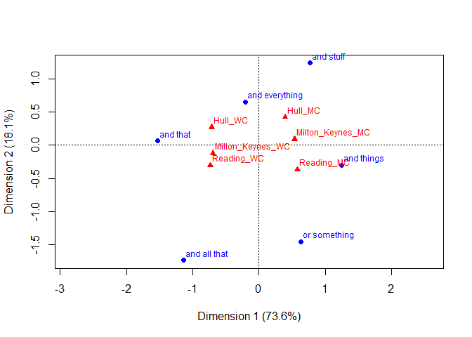

Math of Correspondence Analysis
================
Dr. Claudia Roch M.A.
2022-11-08

-   <a
    href="#math-of-correspondence-analysis---case-study-pragmatic-extenders-used-by-english-teenagers"
    id="toc-math-of-correspondence-analysis---case-study-pragmatic-extenders-used-by-english-teenagers">Math
    of Correspondence Analysis - Case Study “Pragmatic Extenders used by
    English Teenagers”</a>
-   <a href="#sources--preparation" id="toc-sources--preparation">Sources
    &amp; Preparation</a>
-   <a href="#0-case-study---pragmatic-extenders-used-by-english-teenagers"
    id="toc-0-case-study---pragmatic-extenders-used-by-english-teenagers">0.
    Case Study - Pragmatic Extenders used by English Teenagers</a>
    -   <a href="#01-research-questions" id="toc-01-research-questions">0.1
        Research questions</a>
    -   <a href="#02-dataset" id="toc-02-dataset">0.2 Dataset</a>
    -   <a href="#03-performing-statistical-tests"
        id="toc-03-performing-statistical-tests">0.3 Performing statistical
        tests</a>
        -   <a href="#031-chi2-test" id="toc-031-chi2-test">0.3.1 Chi^2-test</a>
        -   <a href="#032-pearsons-residuals" id="toc-032-pearsons-residuals">0.3.2
            Pearson’s residuals</a>
        -   <a href="#033-cramers-v-intensity-of-the-relationship"
            id="toc-033-cramers-v-intensity-of-the-relationship">0.3.3 Cramer’s V:
            intensity of the relationship</a>
    -   <a href="#04-a-first-look-at-ca-analysis-and-interpretation"
        id="toc-04-a-first-look-at-ca-analysis-and-interpretation">0.4 A first
        look at ca analysis and interpretation</a>
    -   <a href="#05-validation-of-calculations-with-the-ca-package"
        id="toc-05-validation-of-calculations-with-the-ca-package">0.5
        Validation of calculations with the <code>ca</code> package</a>
-   <a href="#10-observed-proportions-profiles-and-masses"
    id="toc-10-observed-proportions-profiles-and-masses">1.0 Observed
    proportions, profiles and masses</a>
    -   <a href="#11-row-and-column-totals"
        id="toc-11-row-and-column-totals">1.1 Row and Column Totals</a>
    -   <a
        href="#12-calculating-observed-proportions-p-in-a-correspondence-matrix"
        id="toc-12-calculating-observed-proportions-p-in-a-correspondence-matrix">1.2
        Calculating observed proportions P in a correspondence matrix</a>
    -   <a href="#13-profiles-and-masses" id="toc-13-profiles-and-masses">1.3
        Profiles and Masses</a>
        -   <a href="#131-row-and-column-profiles"
            id="toc-131-row-and-column-profiles">1.3.1 Row and column profiles</a>
            -   <a href="#row-profiles" id="toc-row-profiles">Row profiles</a>
            -   <a href="#column-profiles" id="toc-column-profiles">Column profiles</a>
        -   <a href="#132-masses-of-rows-and-columns"
            id="toc-132-masses-of-rows-and-columns">1.3.2 Masses of rows and
            columns</a>
-   <a href="#2-expected-proportions-and-frequencies"
    id="toc-2-expected-proportions-and-frequencies">2. Expected Proportions
    and Frequencies</a>
    -   <a href="#21-expected-proportions-expected-proportions-e"
        id="toc-21-expected-proportions-expected-proportions-e">2.1 Expected
        proportions (expected proportions) E</a>
    -   <a href="#22-expected-frequencies" id="toc-22-expected-frequencies">2.2
        Expected Frequencies</a>
-   <a href="#3-chi-squared-statistics-and-distances"
    id="toc-3-chi-squared-statistics-and-distances">3. Chi-squared
    statistics and distances</a>
    -   <a href="#31-chi-square-statistic" id="toc-31-chi-square-statistic">3.1
        Chi-square statistic</a>
        -   <a href="#311-total-inertia" id="toc-311-total-inertia">3.1.1 <em>Total
            Inertia</em></a>
    -   <a href="#32-chi-squared-distance" id="toc-32-chi-squared-distance">3.2
        Chi-squared distance</a>
-   <a href="#4-residuals-standardized-residuals"
    id="toc-4-residuals-standardized-residuals">4. Residuals, standardized
    Residuals</a>
    -   <a href="#41-residuals" id="toc-41-residuals">4.1 Residuals</a>
    -   <a href="#42-calculation-of-the-standardized-residual-z"
        id="toc-42-calculation-of-the-standardized-residual-z">4.2 Calculation
        of the standardized residual Z</a>
-   <a href="#5-singular-value-decomposition"
    id="toc-5-singular-value-decomposition">5. Singular Value
    Decomposition</a>
    -   <a href="#51-singular-value-decomposition-svd"
        id="toc-51-singular-value-decomposition-svd">5.1 Singular Value
        Decomposition (SVD)</a>
    -   <a href="#52-eigenvalues" id="toc-52-eigenvalues">5.2 Eigenvalues</a>
        -   <a href="#521-scree-plot" id="toc-521-scree-plot">5.2.1 Scree-Plot</a>
    -   <a href="#53-coordinates" id="toc-53-coordinates">5.3 Coordinates</a>
        -   <a href="#531-principal-coordinates"
            id="toc-531-principal-coordinates">5.3.1 Principal Coordinates</a>
        -   <a href="#532-standard-coordinates"
            id="toc-532-standard-coordinates">5.3.2 Standard coordinates</a>
        -   <a href="#533-reciprocal-calculation-of-the-coordinates"
            id="toc-533-reciprocal-calculation-of-the-coordinates">5.3.3 Reciprocal
            calculation of the coordinates</a>
-   <a href="#6-results-numerical-values-of-the-analysis"
    id="toc-6-results-numerical-values-of-the-analysis">6. Results:
    Numerical values of the analysis</a>
    -   <a href="#61-further-inertia-weights"
        id="toc-61-further-inertia-weights">6.1 Further inertia weights</a>
        -   <a
            href="#611-contribution-of-the-rows-related-to-the-axes-ctr-value-of-the-summary"
            id="toc-611-contribution-of-the-rows-related-to-the-axes-ctr-value-of-the-summary">6.1.1
            Contribution of the rows related to the axes (<code>ctr</code>-value of
            the summary)</a>
        -   <a href="#612-inertia-of-the-rows-and-columns-inr--value-of-the-summary"
            id="toc-612-inertia-of-the-rows-and-columns-inr--value-of-the-summary">6.1.2
            Inertia of the rows and columns: <code>inr</code>- value of the
            summary</a>
    -   <a
        href="#62-values-of-correlations-with-the-axes-cor-and-quality-qlt-value-of-the-summary"
        id="toc-62-values-of-correlations-with-the-axes-cor-and-quality-qlt-value-of-the-summary">6.2
        Values of correlations with the axes (<code>cor</code>) and quality
        (<code>qlt</code> value of the summary)</a>
-   <a href="#70-validation-by-ca-package"
    id="toc-70-validation-by-ca-package">7.0 Validation by <code>ca</code>
    package</a>
    -   <a href="#71-validation-of-row-and-column-masses"
        id="toc-71-validation-of-row-and-column-masses">7.1 Validation of row
        and column masses</a>
    -   <a href="#72-validation-of-chi-squared-distances"
        id="toc-72-validation-of-chi-squared-distances">7.2 Validation of
        chi-squared distances</a>
    -   <a href="#73-validation-of-standard-coordinates-of-row-and-columns"
        id="toc-73-validation-of-standard-coordinates-of-row-and-columns">7.3
        Validation of standard coordinates of row and columns</a>
    -   <a href="#74-validation-of-principal-coordinates"
        id="toc-74-validation-of-principal-coordinates">7.4 Validation of
        principal coordinates</a>
    -   <a href="#75-validation-of-inertia-values-inertia-weights"
        id="toc-75-validation-of-inertia-values-inertia-weights">7.5 Validation
        of inertia-values (inertia weights)</a>
    -   <a href="#76-validation-of-cor-and-qlt-values"
        id="toc-76-validation-of-cor-and-qlt-values">7.6 Validation of
        <code>cor</code> and <code>qlt</code> values</a>
-   <a href="#8-different-visualisations"
    id="toc-8-different-visualisations">8. Different Visualisations</a>
    -   <a href="#81-method-symmetric-map" id="toc-81-method-symmetric-map">8.1
        Method: Symmetric map:</a>
    -   <a href="#82-method-rowprincipal" id="toc-82-method-rowprincipal">8.2
        Method: “rowprincipal”</a>
    -   <a href="#83-method-colprincipal" id="toc-83-method-colprincipal">8.3
        Method: “colprincipal”</a>
-   <a href="#references" id="toc-references">References</a>

# Math of Correspondence Analysis - Case Study “Pragmatic Extenders used by English Teenagers”

# Sources & Preparation

This notebook has been created for the [Exploratory Data
Analysis](https://vvz.ruhr-uni-bochum.de/campus/all/event.asp?objgguid=NEW&from=vvz&gguid=0xE2AC2ABDE5C3474A92007FEE6D3FECBA&mode=own&tguid=0xBEC4EBD3E08E451BB6DEBD69F230152F&lang=en)
Advanced Course at Linguistic Data Science Lab, Ruhr University Bochum.

The primary aim of this notebook is to follow along the mathematical
foundations of correspondence analysis. We “manually” calculate all
coordinates and summary statistics and compare the values to the output
of pre-compiled `ca`-packages.

The secondary aim is to explore a case study that deals with a
linguistic phenomenon - the local dialect in different social classes of
English teenagers from three local cities.

**Sources:**

The notebook is based on the following sources:

-   Desagulier (2017), chapter 10, see also [additional
    materials](http://extras.springer.com/2017/978-3-319-64570-4).

-   The part on the mathematical foundation of CA relies on a [script by
    Tim Bock](https://www.displayr.com/math-correspondence-analysis/).

**Required R packages:** `ca`, `data.table`

``` r
library("ca"); library("data.table")
```

    ## Warning: Paket 'ca' wurde unter R Version 4.2.2 erstellt

# 0. Case Study - Pragmatic Extenders used by English Teenagers

We use the `extenders` dataset following a case study as presented in
ch. 10 of Desagulier (2017). The original dataset was recorded by
Cheshire (2007) and contains frequencies for pragmatic extenders (*and
that*, *and all that*, *and stuff*, *and things*, *and everything*, *or
something*).

> General extenders are clause-final pragmatic particles appended to a
> word, a phrase, or a clause (Cheshire 2007, p. 156).

> Their basic pattern is a conjunction (*and* or *but*) followed by a
> noun phrase. (Desagulier 2017:257)

The following examples (after Desagulier 2017:257) illustrate their
usage:

-   *Steve works in the engineering office and has taken over some of
    the er you know purchasing function as well, like enquiries **and
    stuff**.* (BNC–JP2)
-   *And I don’t think we do it so much with the erm (pause) careers
    service training, but with the careers teachers often we’ve got them
    doing action plans **and things**.* (BNC–G4X)
-   *I knew exactly where to stop it so that I could get off and go down
    the ladder, sneak a cup of tea **or something**.* (BNC–FXV)

Following Desagulier (2017), we aim to explore the use of extenders in
the language of English teenagers from different social classes (working
class (WC) or middle class(MC)) from three English towns (Reading,
Milton-Keynes, Hull) applying correspondence analysis. The towns are
located in three distinct regional locations in England. Cheshire
(2007:164) argues that

> “there \[is\] a robust socialclass distinction in the use of certain
> forms (. . . )”

The variables for correspondence analysis are hence **pragmatic
extender** vs. the conflated variable **Region_social class** of the
teenagers.

Before we take a look at the data and explore it by applying
correspondence analysis, let us formulate a few research questions:

## 0.1 Research questions

-   Are there geographic/social differences across the data set? And, if
    so, what are these differences?

-   Which linguistic forms have the same regional and social profiles?

-   What are the linguistic profiles of each region/social class with
    respect to general extenders?

## 0.2 Dataset

``` r
# read rds file which stores the dataset as a single R object
extendersdata <- readRDS("df_extenders.rds")
extendersdata
```

    ##                Reading_MC Reading_WC Milton_Keynes_MC Milton_Keynes_WC Hull_MC
    ## and that                4         49                9               44      10
    ## and all that            4         14                2                4       1
    ## and stuff              36          6               45                5      62
    ## and things             32          0               35                0      12
    ## and everything         21         16               22               18      30
    ## or something           72         20               30               17      23
    ##                Hull_WC
    ## and that            66
    ## and all that         4
    ## and stuff           18
    ## and things           5
    ## and everything      31
    ## or something         3

``` r
class(extendersdata)
```

    ## [1] "data.frame"

The dataset’s format is a **contingency table**.

> A contingency table or crosstab indicates, for two or more categorical
> variables, how frequently the combinations of characteristic values
> occur.

The frequencies in the rows are referred to as n<sub>ij</sub> where i
numbers the rows 1 to I (I=6) and j numbers the columns 1 to J (J=6). In
the data matrix IxJ e.g. we grasp that n<sub>42</sub> = 0.

``` r
N = extendersdata
I <- nrow(N)
J <- ncol(N)
I
```

    ## [1] 6

``` r
J
```

    ## [1] 6

``` r
N[4,2]
```

    ## [1] 0

The values of a variable (e.g. ‘*and that*’) are referred to as points
(in case of ‘*and that*’ it is actually a row point.) Row points and
column points can be depicted in a joint space in a map.

## 0.3 Performing statistical tests

The background of performing statistical tests is that we want to check
whether the rows and columns are not independent (this means basically
whether the research question is reasonable at all), although
theoretically in exploratory analyses, we would not make assumptions
regarding groupings to be found.

### 0.3.1 Chi^2-test

The χ 2 test checks the significance of the overall deviation of the
data in the contingency table from the independence model. It computes
the contribution of each cell to χ 2 and sums up all contributions.

``` r
chisq <- chisq.test(extendersdata)
```

    ## Warning in chisq.test(extendersdata): Chi-Quadrat-Approximation kann inkorrekt
    ## sein

``` r
chisq
```

    ## 
    ##  Pearson's Chi-squared test
    ## 
    ## data:  extendersdata
    ## X-squared = 384.12, df = 25, p-value < 2.2e-16

\[Eventually, consider a tool for converting scientific notation
e.g. <https://calculator.name/scientific-notation/scientific-notation-to-decimal.php>\]

Here, χ 2 has a high value and it is associated with very small p-value
(0.00000000000000022). This implies that the row and column variables
are not independent and that there is a relationship. However, the
magnitude of the χ 2 value should not be interpreted as quantifying the
effect of the correlation, because it depends on the sample size.

How do we know if the determined Chi-square value is a large value?

We can use statistics tables with the Chi-squared distribution to
compare our values, like
e.g. <https://en.wikibooks.org/wiki/Engineering_Tables/Chi-Squared_Distibution>.
We have to check the cell for the corresponding degrees of freedom (see
df=25 value in output) and the assumed significance level (e.g. 0.05.).
If the calculated chi-square value is smaller than the critical value,
the null hypothesis can be retained.

For an IxJ table (6x6=36), the number of degrees of freedom is given by
(I-1)x(J-1) or (5x5=25)). Degrees of freedom refers to the number of
values that can be varied without changing the relevant statistical
parameter. For example, if you take the arithmetic mean of three values,
then you can freely vary two and get the same result, the last value
cannot be freely varied, because it is already determined.

$$1+2+3/3 = 2$$ $$2+4+0/3 = 2$$ but not $$2+4+1$$

As the most important significance levels we distinguish: 0,05 (\< = 5%
significant), (95%) 0,01 (\< = 1% very significant), (99%) 0,001(\< =
0,1% highly significant) (99,9%).

The test statistic is usually associated with a P-value which indicates
the small probability (0.001 corresponds to 1 in 1000) of yet
reconciling the observed frequencies with the independence hypothesis.
The P-value indicates how incompatible data are with a particular
statistical model: the smaller the value, the greater the
incompatibility with the null hypothesis. P-values do not measure the
probability that a hypothesis under investigation is true (see
Wasserstein & Lazar 2016).

In general the test imposes conditions that all observations are
independent and that 80+% of the expected frequencies are larger than 5.

``` r
chisq$exp
```

    ##                Reading_MC Reading_WC Milton_Keynes_MC Milton_Keynes_WC
    ## and that        39.945455  24.818182        33.800000        20.800000
    ## and all that     6.364935   3.954545         5.385714         3.314286
    ## and stuff       37.750649  23.454545        31.942857        19.657143
    ## and things      18.436364  11.454545        15.600000         9.600000
    ## and everything  30.288312  18.818182        25.628571        15.771429
    ## or something    36.214286  22.500000        30.642857        18.857143
    ##                  Hull_MC   Hull_WC
    ## and that       32.618182 30.018182
    ## and all that    5.197403  4.783117
    ## and stuff      30.825974 28.368831
    ## and things     15.054545 13.854545
    ## and everything 24.732468 22.761039
    ## or something   29.571429 27.214286

In our case, the dataset does not meet the second assumption (only 67%
of the sample size is greater 5) but Greenacre (2007) argues that it can
be applied . Given very small p-value, the significance of the deviation
of the table from independence is not deniable.

Later on, in section 3.1, we will see how to calculate the chi-square
value manually, with some more in depth discussion.

### 0.3.2 Pearson’s residuals

Pearson’s r is a correlation measure for the association between two
random variables (x and y).

If the Pearson residual in a cell is positive/negative, then the
observed frequency in that cell is greater/less than the expected
frequency in that cell. Second, the more the Pearson residual deviates
from 0, the stronger that effect, or, in other words, the closer the
coefficient is to 0, the weaker the correlation.

``` r
chisq$res
```

    ##                Reading_MC Reading_WC Milton_Keynes_MC Milton_Keynes_WC
    ## and that       -5.6873545  4.8540469       -4.2657297        5.0869365
    ## and all that   -0.9373941  5.0515110       -1.4589105        0.3766589
    ## and stuff      -0.2849292 -3.6040851        2.3102622       -3.3058955
    ## and things      3.1589191 -3.3844564        4.9117859       -3.0983867
    ## and everything -1.6877155 -0.6496511       -0.7167595        0.5611656
    ## or something    5.9466137 -0.5270463       -0.1161314       -0.4276686
    ##                   Hull_MC    Hull_WC
    ## and that       -3.9602975  6.5673614
    ## and all that   -1.8411427 -0.3580726
    ## and stuff       5.6148026 -1.9467451
    ## and things     -0.7872502 -2.3788668
    ## and everything  1.0591891  1.7269367
    ## or something   -1.2084360 -4.6416586

Upon inspection of the values we observe a strong effect for:

-   ‘*and that*’ - ‘*Reading_MC*’ (-5.69), - ‘*Milton_Keynes_MC*’
    (-4.27),- ‘*Milton_Keynes_WC*’ (5.09), - ‘*Hull_WC*’ (6.57)
-   ‘*or something*’ - ‘*Reading_MC*’ (5.95), - ‘*Hull_WC*’ (-4.64)
-   ‘*and all that*’ - ‘*Reading_WC*’ (5.05)
-   ‘*and things*’ - ‘*Milton_Keynes_MC*’ (4.91)
-   ‘*and stuff*’ - ‘*Hull_MC*’ (5.61) …

### 0.3.3 Cramer’s V: intensity of the relationship

The intensity of the relationship is measured with Cramér’s V, and it is
non negligible for the dataset. The perfect score of 1 is unrealistic
here, as the association between the use of extenders and the
socio-geographic background is not exclusive (cf. Desagulier 2017:269).

``` r
Vdif <- sqrt(chisq$stat/(sum(extendersdata) * (min(dim(extendersdata))-1)))
round(Vdif, 3)
```

    ## X-squared 
    ##     0.316

See also section 3.1 for the formula how to calculate it.

## 0.4 A first look at ca analysis and interpretation

Before we proceed with complex mathematical operations, let us have a
first look at what a CA analysis of the dataset looks and what initial
observations can be made.

Without the help of a CA graph, Cheshire (2007, p. 164) interprets the
table of frequencies as follows:

> Of the adjunctives, *and that* was preferred by the working-class
> speakers in all three towns, as was the less frequent *and all that*.
> The middle-class speakers, on the other hand, preferred *and stuff*
> and *and things* again in all three towns, though in Hull the
> middle-class adolescents used *and stuff* far more often than *and
> things* (the relatively high frequency of *and stuff* for the
> working-class group in Hull was due to just three speakers, one of
> whom was responsible for 10 of the 18 tokens).

Keeping in mind those observations, we will now plot the low-dimensional
map resulting from the CA analysis and inspect it.

``` r
library(ca)
# performing ca with ca package
ca_ext <- ca(extendersdata, graph=F)
par(mfrow=c(1,2)) # set the plotting area into a 1*2 array
# plotting first two dimensions
plot(ca_ext, dim=c(1:2))
# and second and third dimension
plot(ca_ext, dim=c(3:2))
```

<!-- -->

When we interpret the map of the first and second dimension, we find

-   a clear divide between the use of extenders by middle-class and
    working-class informants on the first axis
    -   extenders favored by middle-class teenagers are *or something*,
        *and things*, and *and stuff*
    -   extenders favored by working-class teenagers are *and all that*,
        and *and that*
    -   *and everything* in the middle is well projected along the
        vertical axis, and seems to be indifferent to socio-geographic
        groups
-   that the vertical axis shows a difference between Hull and Reading
    representing the geographical dissimilarity with Milton Keynes
    somewhere in between; Note: Hull is in Yorkshire (northern England),
    whereas Reading and Milton Keynes are much further south.

When inspecting the second and third dimensional view zooming in a
little bit, we observe that

-   *and all that* (Freq. R:18, M:6, H:5) and *or something* (Freq.
    R:92, M:47, H:26) group with Reading
-   *and stuff* (Freq. R:42, M:50, H:80) and *and everything* (Freq: R:
    37, M: 40, H:61) group with Hull
-   *and things* (Freq. R:32, M:35, H:17) and *and that* (Freq. R: 53,
    M:53, H:76) which are very dissimilar in the first dimension
    (because of being differently associated with middle and working
    class) are not separated by the third dimension. They appear close
    to Milton Keynes but are relatively frequently used in all towns.

In sum, we find that the dimension-reduction technique to represent the
(dis-)similarity between variables in a map, yields insights which are
in line with the interpretation of raw frequencies. For the moment, we
have skipped a look at the numerical results of correspondence analysis
which are equally important in interpretation, and we will turn to those
when considering the mathematical foundation.

## 0.5 Validation of calculations with the `ca` package

There are different R packages for performing correspondence analysis:
throughout this notebook we use Greenacre & Nenadic’s (2020) `ca`
package and apply the `ca()` command for simple correspondence analysis.
In the output below, you will see the existing variables of a
ca-analysis object. We will load the single predefined variables during
our calculations to check whether our manually obtained results are
correct.

``` r
library(ca)
ca_validation <- ca(N)
str(ca_validation)
```

    ## List of 16
    ##  $ sv        : num [1:5] 0.60601 0.30081 0.16076 0.12343 0.00644
    ##  $ nd        : logi NA
    ##  $ rownames  : chr [1:6] "and that" "and all that" "and stuff" "and things" ...
    ##  $ rowmass   : num [1:6] 0.2364 0.0377 0.2234 0.1091 0.1792 ...
    ##  $ rowdist   : num [1:6] 0.934 1.053 0.613 0.855 0.244 ...
    ##  $ rowinertia: num [1:6] 0.2062 0.0418 0.084 0.0798 0.0107 ...
    ##  $ rowcoord  : num [1:6, 1:5] -1.534 -1.141 0.771 1.246 -0.209 ...
    ##   ..- attr(*, "dimnames")=List of 2
    ##   .. ..$ : chr [1:6] "and that" "and all that" "and stuff" "and things" ...
    ##   .. ..$ : chr [1:5] "Dim1" "Dim2" "Dim3" "Dim4" ...
    ##  $ rowsup    : logi(0) 
    ##  $ colnames  : chr [1:6] "Reading_MC" "Reading_WC" "Milton_Keynes_MC" "Milton_Keynes_WC" ...
    ##  $ colmass   : num [1:6] 0.219 0.136 0.186 0.114 0.179 ...
    ##  $ coldist   : num [1:6] 0.694 0.841 0.593 0.731 0.624 ...
    ##  $ colinertia: num [1:6] 0.1058 0.0964 0.0653 0.0611 0.0699 ...
    ##  $ colcoord  : num [1:6, 1:5] 0.955 -1.214 0.883 -1.149 0.651 ...
    ##   ..- attr(*, "dimnames")=List of 2
    ##   .. ..$ : chr [1:6] "Reading_MC" "Reading_WC" "Milton_Keynes_MC" "Milton_Keynes_WC" ...
    ##   .. ..$ : chr [1:5] "Dim1" "Dim2" "Dim3" "Dim4" ...
    ##  $ colsup    : logi(0) 
    ##  $ N         : int [1:6, 1:6] 4 4 36 32 21 72 49 14 6 0 ...
    ##  $ call      : language ca.matrix(obj = as.matrix(obj))
    ##  - attr(*, "class")= chr "ca"

We can also print a condensed summary of the analysis’ results with
`summary` where variables are abbreviated in the output. We will explain
the values’ significance in short.

``` r
# print summary
summary(ca_validation)
```

    ## 
    ## Principal inertias (eigenvalues):
    ## 
    ##  dim    value      %   cum%   scree plot               
    ##  1      0.367243  73.6  73.6  ******************       
    ##  2      0.090489  18.1  91.8  *****                    
    ##  3      0.025842   5.2  96.9  *                        
    ##  4      0.015235   3.1 100.0  *                        
    ##  5      4.2e-050   0.0 100.0                           
    ##         -------- -----                                 
    ##  Total: 0.498851 100.0                                 
    ## 
    ## 
    ## Rows:
    ##       name   mass  qlt  inr    k=1 cor ctr    k=2 cor ctr  
    ## 1 | andtht |  236  991  413 | -930 991 556 |   21   1   1 |
    ## 2 |   andl |   38  677   84 | -691 431  49 | -523 247 114 |
    ## 3 |   ands |  223  951  168 |  467 581 133 |  373 370 343 |
    ## 4 | andthn |  109  791  160 |  755 779 169 |  -92  12  10 |
    ## 5 |   andv |  179  923   21 | -126 269   8 |  197 654  77 |
    ## 6 |   orsm |  214  946  153 |  381 408  85 | -438 538 454 |
    ## 
    ## Columns:
    ##      name   mass  qlt  inr    k=1 cor ctr    k=2 cor ctr  
    ## 1 |  R_MC |  219  983  212 |  579 695 200 | -373 288 337 |
    ## 2 |  R_WC |  136  898  193 | -736 766 201 | -306 132 141 |
    ## 3 | M_K_M |  186  836  131 |  535 813 145 |   90  23  17 |
    ## 4 | M_K_W |  114  934  122 | -696 907 151 | -121  27  18 |
    ## 5 |  H_MC |  179  858  140 |  395 400  76 |  422 458 354 |
    ## 6 |  H_WC |  165  952  201 | -711 831 227 |  271 121 134 |

# 1.0 Observed proportions, profiles and masses

Before we start with the mathematical calculations to obtain observed
proportions, we need to transform the raw frequencies in the contingency
table, e.g. by adding the margin totals.

## 1.1 Row and Column Totals

We create the row sums (`rowSums`) and column sums (`colSums`) of N,
bind them to the margins of the original table and name the additional
row and column.

``` r
N_total = rbind(N, colSums(N))
N_total = cbind(N_total, rowSums(N_total))
rownames(N_total)[7] <- "columntotal"
colnames(N_total)[7] <- "rowtotal"
N_total
```

    ##                Reading_MC Reading_WC Milton_Keynes_MC Milton_Keynes_WC Hull_MC
    ## and that                4         49                9               44      10
    ## and all that            4         14                2                4       1
    ## and stuff              36          6               45                5      62
    ## and things             32          0               35                0      12
    ## and everything         21         16               22               18      30
    ## or something           72         20               30               17      23
    ## columntotal           169        105              143               88     138
    ##                Hull_WC rowtotal
    ## and that            66      182
    ## and all that         4       29
    ## and stuff           18      172
    ## and things           5       84
    ## and everything      31      138
    ## or something         3      165
    ## columntotal        127      770

## 1.2 Calculating observed proportions P in a correspondence matrix

In this step, we transform the frequencies of the contingency table into
proportions.

Therefore, we first need the total frequency n of all observed instances
in table `N` which can be obtained by applying the function `sum()` to
the table.

``` r
n <- sum(N)
n
```

    ## [1] 770

Next, we create the table with the observed proportions `P` through the
following formula. To calculate the *correspondence matrix* of relative
frequencies p<sub>ij</sub>, frequencies are divided by the total
frequency n.

``` r
P <- N/n

P
```

    ##                 Reading_MC  Reading_WC Milton_Keynes_MC Milton_Keynes_WC
    ## and that       0.005194805 0.063636364      0.011688312      0.057142857
    ## and all that   0.005194805 0.018181818      0.002597403      0.005194805
    ## and stuff      0.046753247 0.007792208      0.058441558      0.006493506
    ## and things     0.041558442 0.000000000      0.045454545      0.000000000
    ## and everything 0.027272727 0.020779221      0.028571429      0.023376623
    ## or something   0.093506494 0.025974026      0.038961039      0.022077922
    ##                    Hull_MC     Hull_WC
    ## and that       0.012987013 0.085714286
    ## and all that   0.001298701 0.005194805
    ## and stuff      0.080519481 0.023376623
    ## and things     0.015584416 0.006493506
    ## and everything 0.038961039 0.040259740
    ## or something   0.029870130 0.003896104

## 1.3 Profiles and Masses

In this section we will understand the important concepts of profiles
and masses.

### 1.3.1 Row and column profiles

> A row, or a column of a contingency table in which elements have been
> divided by the row sums or column sums respectively. Profiles are
> visualized as points in space by correspondence analysis.(cf. Hautz &
> Bleuel 2018:221)

For the next step, we note that profiles are obtained by creating
relative frequencies from the marginal sums instead of dividing them by
the total frequency n.

#### Row profiles

Considering the row sums, we obtain relative frequencies for the rows,
that make the profile for each row point.

The row profile for the row point ‘*and that*’ across the
social-geographical groups of teenagers is determined in the following
way: We divide the count in each cell in the row by the row sum in
`N_total` of the respective row.

The calculations inside the first row are the following:
$$4 : 182, 49:182, 9:182, 44:182, 10:182, 66:182$$

``` r
N[1,1]/N_total[1,7]
```

    ## [1] 0.02197802

``` r
N[1,2]/N_total[1,7]
```

    ## [1] 0.2692308

``` r
N[1,3]/N_total[1,7]
```

    ## [1] 0.04945055

``` r
N[1,4]/N_total[1,7]
```

    ## [1] 0.2417582

``` r
N[1,5]/N_total[1,7]
```

    ## [1] 0.05494505

``` r
N[1,6]/N_total[1,7]
```

    ## [1] 0.3626374

The percentages are used to normalize the row totals to the value 1, so
that the rows can now be compared with each other regardless of the
frequency of their absolute mentions.

The first value of the row profile indicates that the extender ‘*and
that*’ is in 2% used by ‘*Reading_MC*’ teenagers.

**Matrix of row profiles or profiles of extenders**

To obtain the row profiles for the complete table we use the `sweep()`
function which is similar to `apply()`.

`sweep(x, MARGIN, STATS, FUN)` applies an operation to a data matrix
over the rows or over the columns. The parameter `MARGIN =1` sweeps over
the rows, while `MARGIN =2` sweeps over the columns. STATS is the value
used in the operation (e.g. 2), FUN is the type of operation (e.g. +,
-).

``` r
# sweep function divides each element of the matrix N by the sum of its respective row
# 1: The margin over which the operation is applied. 1 indicates rows, and 2 would indicate columns
# "/" indicates division operation
row.profiles = sweep(N, 1, (rowSums(N)), "/")
row.profiles
```

    ##                Reading_MC Reading_WC Milton_Keynes_MC Milton_Keynes_WC
    ## and that       0.02197802 0.26923077       0.04945055       0.24175824
    ## and all that   0.13793103 0.48275862       0.06896552       0.13793103
    ## and stuff      0.20930233 0.03488372       0.26162791       0.02906977
    ## and things     0.38095238 0.00000000       0.41666667       0.00000000
    ## and everything 0.15217391 0.11594203       0.15942029       0.13043478
    ## or something   0.43636364 0.12121212       0.18181818       0.10303030
    ##                   Hull_MC    Hull_WC
    ## and that       0.05494505 0.36263736
    ## and all that   0.03448276 0.13793103
    ## and stuff      0.36046512 0.10465116
    ## and things     0.14285714 0.05952381
    ## and everything 0.21739130 0.22463768
    ## or something   0.13939394 0.01818182

Note: `apply()` (returns a vector, array or a list of values by applying
a function to the margins of an array (data object with possibly more
than two dimensions) or of a matrix);

The **average row** of the matrix of row profiles can be determined by
the column totals of the table of margin totals `N_Total` divided by the
total frequency n.

``` r
# calculatin averages
row.averages <-  c(N_total[7,1]/n, N_total[7,2]/n, N_total[7,3]/n, N_total[7,4]/n, N_total[7,5]/n, N_total[7,6]/n)
# appending the averages to a new row
row.profiles.av <- rbind(row.profiles, row.averages)
# and naming the row
rownames(row.profiles.av) [7] <- "average row profile"
row.profiles.av
```

    ##                     Reading_MC Reading_WC Milton_Keynes_MC Milton_Keynes_WC
    ## and that            0.02197802 0.26923077       0.04945055       0.24175824
    ## and all that        0.13793103 0.48275862       0.06896552       0.13793103
    ## and stuff           0.20930233 0.03488372       0.26162791       0.02906977
    ## and things          0.38095238 0.00000000       0.41666667       0.00000000
    ## and everything      0.15217391 0.11594203       0.15942029       0.13043478
    ## or something        0.43636364 0.12121212       0.18181818       0.10303030
    ## average row profile 0.21948052 0.13636364       0.18571429       0.11428571
    ##                        Hull_MC    Hull_WC
    ## and that            0.05494505 0.36263736
    ## and all that        0.03448276 0.13793103
    ## and stuff           0.36046512 0.10465116
    ## and things          0.14285714 0.05952381
    ## and everything      0.21739130 0.22463768
    ## or something        0.13939394 0.01818182
    ## average row profile 0.17922078 0.16493506

The average row profile tells us that irrespective of the chosen
extender 21% of the usages are attributed to ‘*Reading_MC*’, 13% to
‘*Reading_WC*’, 18% to ‘*Milton_Keynes_MC*’, 11% to
‘*Milton_Keynes_WC*’, 17% to ‘*Hull_MC*’ and 16% to ‘*Hull_WC*’
teenagers. In this way, we can compare the profiles of extenders to each
other or to the average row. The use of the extender ‘*and that*’
e.g. lies below the average row profile in case of ‘*Reading_MC*’,
‘*Milton_Keynes_MC*’ and ‘*Hull_MC*’, and above the average row profile
in case of ‘*Reading_WC*’, ‘*Milton_Keynes_WC*’ and ‘*Hull_WC*’.

#### Column profiles

Considering the column sums, we obtain relative frequencies for the
columns, that make the profile for each column point . For example for
the first column:

``` r
N_total[1,1]/N_total[7,1]
```

    ## [1] 0.02366864

``` r
N_total[2,1]/N_total[7,1]
```

    ## [1] 0.02366864

``` r
N_total[3,1]/N_total[7,1]
```

    ## [1] 0.2130178

``` r
N_total[4,1]/N_total[7,1]
```

    ## [1] 0.1893491

``` r
N_total[5,1]/N_total[7,1]
```

    ## [1] 0.1242604

``` r
N_total[6,1]/N_total[7,1]
```

    ## [1] 0.4260355

**Matrix of column profiles**, or profiles of social-geographical groups
of teenagers

``` r
# sweep operation on columns
col.profiles = sweep(N, 2, (colSums(N)), "/")
col.profiles
```

    ##                Reading_MC Reading_WC Milton_Keynes_MC Milton_Keynes_WC
    ## and that       0.02366864 0.46666667       0.06293706       0.50000000
    ## and all that   0.02366864 0.13333333       0.01398601       0.04545455
    ## and stuff      0.21301775 0.05714286       0.31468531       0.05681818
    ## and things     0.18934911 0.00000000       0.24475524       0.00000000
    ## and everything 0.12426036 0.15238095       0.15384615       0.20454545
    ## or something   0.42603550 0.19047619       0.20979021       0.19318182
    ##                    Hull_MC    Hull_WC
    ## and that       0.072463768 0.51968504
    ## and all that   0.007246377 0.03149606
    ## and stuff      0.449275362 0.14173228
    ## and things     0.086956522 0.03937008
    ## and everything 0.217391304 0.24409449
    ## or something   0.166666667 0.02362205

From the column profile we grasp that in the group of ‘*Reading_MC*’
teenagers, the extender ‘*and that*’ was used in 2%, ‘*and all that*’ in
2%, ‘*and stuff*’ in 21%, ‘*and things*’ in 18%, ‘*and everything*’ in
12% and ‘*or something*’ in 42% of cases.

We again add the average column profile to the table in the last column.

``` r
# calculate averages
col.averages <-  c(N_total[1,7]/n, N_total[2,7]/n, N_total[3,7]/n, N_total[4,7]/n, N_total[5,7]/n, N_total[6,7]/n)
# append averages to new column
col.profiles.av <- cbind(col.profiles, col.averages)
# name column
colnames(col.profiles.av) [7] <- "average column profile"

col.profiles.av
```

    ##                Reading_MC Reading_WC Milton_Keynes_MC Milton_Keynes_WC
    ## and that       0.02366864 0.46666667       0.06293706       0.50000000
    ## and all that   0.02366864 0.13333333       0.01398601       0.04545455
    ## and stuff      0.21301775 0.05714286       0.31468531       0.05681818
    ## and things     0.18934911 0.00000000       0.24475524       0.00000000
    ## and everything 0.12426036 0.15238095       0.15384615       0.20454545
    ## or something   0.42603550 0.19047619       0.20979021       0.19318182
    ##                    Hull_MC    Hull_WC average column profile
    ## and that       0.072463768 0.51968504             0.23636364
    ## and all that   0.007246377 0.03149606             0.03766234
    ## and stuff      0.449275362 0.14173228             0.22337662
    ## and things     0.086956522 0.03937008             0.10909091
    ## and everything 0.217391304 0.24409449             0.17922078
    ## or something   0.166666667 0.02362205             0.21428571

From the average column profile we can read that irrespective of the
social-geographical groups, 23% of the instances are ‘*and that*’, 3%
‘*and all that*’, 22% ‘*and stuff*’, 10% ‘*and things*’, 17% ‘*and
everything*’, 21% ‘*or something*’. We can compare the profiles of
social-geographical groups to each other or to the average column.

The use in the group of ‘*Hull_WC*’ e.g. is above the average column for
‘*and that*’ and ‘*and everything*’, and below the average column for
extenders ‘*and all that*’, ‘*and stuff*’, ‘*and things*’, ‘*or
something*’.

One can argue from the point of view of the row or column profiles and
reach the same conclusions (symmetric view). However, the data tables
are sometimes considered asymmetrically as a set of rows or set of
columns, depending on the interest.

The information from both tables can be used to calculate the
*contingency ratios* (cf. Greenacre 2007:11): those are formed from a
row profile element and the corresponding average row profile or from a
column profile element and the corresponding average column profile.
Look at the code below for the different ways to obtain the equal
ratios. In the interpretation, the ratio of ‘*and things*’ and
‘*Reading_MC*’ e.g. says that the combination occurs 1.7 times as much
compared to the average.

``` r
sweep(row.profiles, 2,row.averages, "/")
```

    ##                Reading_MC Reading_WC Milton_Keynes_MC Milton_Keynes_WC
    ## and that        0.1001365  1.9743590        0.2662722        2.1153846
    ## and all that    0.6284432  3.5402299        0.3713528        1.2068966
    ## and stuff       0.9536260  0.2558140        1.4087657        0.2543605
    ## and things      1.7357002  0.0000000        2.2435897        0.0000000
    ## and everything  0.6933368  0.8502415        0.8584169        1.1413043
    ## or something    1.9881657  0.8888889        0.9790210        0.9015152
    ##                  Hull_MC   Hull_WC
    ## and that       0.3065775 2.1986675
    ## and all that   0.1924038 0.8362748
    ## and stuff      2.0112909 0.6344992
    ## and things     0.7971014 0.3608924
    ## and everything 1.2129805 1.3619765
    ## or something   0.7777778 0.1102362

``` r
sweep(col.profiles, 1,col.averages, "/")
```

    ##                Reading_MC Reading_WC Milton_Keynes_MC Milton_Keynes_WC
    ## and that        0.1001365  1.9743590        0.2662722        2.1153846
    ## and all that    0.6284432  3.5402299        0.3713528        1.2068966
    ## and stuff       0.9536260  0.2558140        1.4087657        0.2543605
    ## and things      1.7357002  0.0000000        2.2435897        0.0000000
    ## and everything  0.6933368  0.8502415        0.8584169        1.1413043
    ## or something    1.9881657  0.8888889        0.9790210        0.9015152
    ##                  Hull_MC   Hull_WC
    ## and that       0.3065775 2.1986675
    ## and all that   0.1924038 0.8362748
    ## and stuff      2.0112909 0.6344992
    ## and things     0.7971014 0.3608924
    ## and everything 1.2129805 1.3619765
    ## or something   0.7777778 0.1102362

The calculated profiles are relevant for the geometrical representation
as the following quotes by Greenacre (2007) are pointing towards:

> Profiles consisting of m elements can be plotted as points in an
> m-dimensional space. Because their m elements add up to 1, these
> profile points occupy a restricted region of this space. This region
> is an (m–1)-dimensional subspace known as a simplex. This simplex is
> enclosed within the edges joining all pairs of the m unit vectors on
> the m perpendicular axes. These unit points are also called the
> vertices of the simplex or profile space. The coordinate system within
> this simplex is known as the barycentric coordinate system. (Greenacre
> 2007:16)

> Simplex: a triangle in two dimensions, a tetrahedron in three
> dimensions, and generalizations of these geometric figures in higher
> dimensions; in CA J-dimensional profiles lie inside a simplex defined
> by J vertices in (J − 1)- dimensional space. (Greenacre 2007:265f.)

### 1.3.2 Masses of rows and columns

The next step is to look at the concept of masses which are used as
weights in correspondence analysis.

> Row sums or column sums divided by the total frequency of the
> contingency table.  
> (cf. Hautz & Bleuel 2018:221)

The sum of rows and columns of the table with the proportions is
referred to as mass.

We calculate the column masses `column.masses` by applying`colSums()`to
the table of proportions.

``` r
P
```

    ##                 Reading_MC  Reading_WC Milton_Keynes_MC Milton_Keynes_WC
    ## and that       0.005194805 0.063636364      0.011688312      0.057142857
    ## and all that   0.005194805 0.018181818      0.002597403      0.005194805
    ## and stuff      0.046753247 0.007792208      0.058441558      0.006493506
    ## and things     0.041558442 0.000000000      0.045454545      0.000000000
    ## and everything 0.027272727 0.020779221      0.028571429      0.023376623
    ## or something   0.093506494 0.025974026      0.038961039      0.022077922
    ##                    Hull_MC     Hull_WC
    ## and that       0.012987013 0.085714286
    ## and all that   0.001298701 0.005194805
    ## and stuff      0.080519481 0.023376623
    ## and things     0.015584416 0.006493506
    ## and everything 0.038961039 0.040259740
    ## or something   0.029870130 0.003896104

``` r
column.masses = colSums(P)
column.masses
```

    ##       Reading_MC       Reading_WC Milton_Keynes_MC Milton_Keynes_WC 
    ##        0.2194805        0.1363636        0.1857143        0.1142857 
    ##          Hull_MC          Hull_WC 
    ##        0.1792208        0.1649351

In the same way, we calculate row masses `row.masses` by using
`rowSums()`:

``` r
row.masses = rowSums(P)
row.masses
```

    ##       and that   and all that      and stuff     and things and everything 
    ##     0.23636364     0.03766234     0.22337662     0.10909091     0.17922078 
    ##   or something 
    ##     0.21428571

In the next step, we want to add the masses to the corresponding
profiles. The row profile already contains the average row profile in
the last row, and we want to add the row mass as a new last column. The
column profile, on the other hand, contains the average column profile
as a last column and we want to add the column masses as the last row in
the table.

In order to arrive at the same number of rows and columns we have to add
NA values, because we don’t calculate a mass value for the average row
profile and average column profile.

``` r
row.masses.na <-c(row.masses[0:6],NA)
row.masses.na
```

    ##       and that   and all that      and stuff     and things and everything 
    ##     0.23636364     0.03766234     0.22337662     0.10909091     0.17922078 
    ##   or something                
    ##     0.21428571             NA

``` r
column.masses.na <- c(column.masses[0:6], NA)
column.masses.na
```

    ##       Reading_MC       Reading_WC Milton_Keynes_MC Milton_Keynes_WC 
    ##        0.2194805        0.1363636        0.1857143        0.1142857 
    ##          Hull_MC          Hull_WC                  
    ##        0.1792208        0.1649351               NA

Remember, as the last row of the row profile we added the column sums of
the correspondence matrix (P); the column sums make the average row
profile and are actually identical to the column masses.

``` r
row.averages
```

    ## [1] 0.2194805 0.1363636 0.1857143 0.1142857 0.1792208 0.1649351

``` r
as.numeric(column.masses[1:6])
```

    ## [1] 0.2194805 0.1363636 0.1857143 0.1142857 0.1792208 0.1649351

Also, the values of the average column profile are the same as the row
masses:

``` r
col.averages
```

    ## [1] 0.23636364 0.03766234 0.22337662 0.10909091 0.17922078 0.21428571

``` r
as.numeric(row.masses[1:6])
```

    ## [1] 0.23636364 0.03766234 0.22337662 0.10909091 0.17922078 0.21428571

The average row profile is the **centroid** of the row points in the
correspondence space. This does not mean the “geographic” center, but a
weighted average so that the centroid is closer to points with greater
weight.

> Centroid: the weighted average point (Greenacre 2007:263)

For the geometrical representation this means:

> There is an equivalent way of thinking about the positions of the
> profile points in the profile space which is based on the notion of a
> weighted average, or centroid, of a set of points. In the calculation
> of an ordinary (unweighted) average, each point receives equal weight.
> A weighted average, on the other hand, allows different weights to be
> associated with each point. When points are weighted differently, then
> the centroid does not lie exactly at the “geographical” centre of the
> cloud of points, but tends to lie in a position closer to the points
> with higher weight.(cf. Greenacre 2007:17)

We are now in the position to add masses to the corresponding profiles:

``` r
row.profiles.av.mass <- cbind(row.profiles.av,row.masses.na)
colnames(row.profiles.av.mass) [7] <- "row.masses" 
row.profiles.av.mass
```

    ##                     Reading_MC Reading_WC Milton_Keynes_MC Milton_Keynes_WC
    ## and that            0.02197802 0.26923077       0.04945055       0.24175824
    ## and all that        0.13793103 0.48275862       0.06896552       0.13793103
    ## and stuff           0.20930233 0.03488372       0.26162791       0.02906977
    ## and things          0.38095238 0.00000000       0.41666667       0.00000000
    ## and everything      0.15217391 0.11594203       0.15942029       0.13043478
    ## or something        0.43636364 0.12121212       0.18181818       0.10303030
    ## average row profile 0.21948052 0.13636364       0.18571429       0.11428571
    ##                        Hull_MC    Hull_WC row.masses
    ## and that            0.05494505 0.36263736 0.23636364
    ## and all that        0.03448276 0.13793103 0.03766234
    ## and stuff           0.36046512 0.10465116 0.22337662
    ## and things          0.14285714 0.05952381 0.10909091
    ## and everything      0.21739130 0.22463768 0.17922078
    ## or something        0.13939394 0.01818182 0.21428571
    ## average row profile 0.17922078 0.16493506         NA

The masses of the rows together form the average column profile. This is
the centroid of the column points in the correspondence space. We also
append the column masses (the row sums of the correspondence matrix P)
to the column profile.

``` r
col.profiles.av.mass <- rbind(col.profiles.av, column.masses.na)
rownames(col.profiles.av.mass)[7] <- "col.masses"
col.profiles.av.mass
```

    ##                Reading_MC Reading_WC Milton_Keynes_MC Milton_Keynes_WC
    ## and that       0.02366864 0.46666667       0.06293706       0.50000000
    ## and all that   0.02366864 0.13333333       0.01398601       0.04545455
    ## and stuff      0.21301775 0.05714286       0.31468531       0.05681818
    ## and things     0.18934911 0.00000000       0.24475524       0.00000000
    ## and everything 0.12426036 0.15238095       0.15384615       0.20454545
    ## or something   0.42603550 0.19047619       0.20979021       0.19318182
    ## col.masses     0.21948052 0.13636364       0.18571429       0.11428571
    ##                    Hull_MC    Hull_WC average column profile
    ## and that       0.072463768 0.51968504             0.23636364
    ## and all that   0.007246377 0.03149606             0.03766234
    ## and stuff      0.449275362 0.14173228             0.22337662
    ## and things     0.086956522 0.03937008             0.10909091
    ## and everything 0.217391304 0.24409449             0.17922078
    ## or something   0.166666667 0.02362205             0.21428571
    ## col.masses     0.179220779 0.16493506                     NA

Values of the row representation can be seen as weighted values of the
column representation and the values of the column representation can be
seen as weighted values of the row representation. For illustration,
consider that a cell value is multiplied by the mass and divided by the
average row (within a profile).

As an example we like to go from row profile \[1,1\] to column profile
\[1,1\]. To do so we multiply the cell of the row profile by the row
mass and divide by the average row. This results in the cell of the
column profile. (Alternative: cell of the row profile multiplied by row
mass divided by column mass of the column profile)
$$0.02197802*0.2363636/0.2194805 = 0.02366864$$

View of both profiles

``` r
row.profiles.av.mass
```

    ##                     Reading_MC Reading_WC Milton_Keynes_MC Milton_Keynes_WC
    ## and that            0.02197802 0.26923077       0.04945055       0.24175824
    ## and all that        0.13793103 0.48275862       0.06896552       0.13793103
    ## and stuff           0.20930233 0.03488372       0.26162791       0.02906977
    ## and things          0.38095238 0.00000000       0.41666667       0.00000000
    ## and everything      0.15217391 0.11594203       0.15942029       0.13043478
    ## or something        0.43636364 0.12121212       0.18181818       0.10303030
    ## average row profile 0.21948052 0.13636364       0.18571429       0.11428571
    ##                        Hull_MC    Hull_WC row.masses
    ## and that            0.05494505 0.36263736 0.23636364
    ## and all that        0.03448276 0.13793103 0.03766234
    ## and stuff           0.36046512 0.10465116 0.22337662
    ## and things          0.14285714 0.05952381 0.10909091
    ## and everything      0.21739130 0.22463768 0.17922078
    ## or something        0.13939394 0.01818182 0.21428571
    ## average row profile 0.17922078 0.16493506         NA

``` r
col.profiles.av.mass
```

    ##                Reading_MC Reading_WC Milton_Keynes_MC Milton_Keynes_WC
    ## and that       0.02366864 0.46666667       0.06293706       0.50000000
    ## and all that   0.02366864 0.13333333       0.01398601       0.04545455
    ## and stuff      0.21301775 0.05714286       0.31468531       0.05681818
    ## and things     0.18934911 0.00000000       0.24475524       0.00000000
    ## and everything 0.12426036 0.15238095       0.15384615       0.20454545
    ## or something   0.42603550 0.19047619       0.20979021       0.19318182
    ## col.masses     0.21948052 0.13636364       0.18571429       0.11428571
    ##                    Hull_MC    Hull_WC average column profile
    ## and that       0.072463768 0.51968504             0.23636364
    ## and all that   0.007246377 0.03149606             0.03766234
    ## and stuff      0.449275362 0.14173228             0.22337662
    ## and things     0.086956522 0.03937008             0.10909091
    ## and everything 0.217391304 0.24409449             0.17922078
    ## or something   0.166666667 0.02362205             0.21428571
    ## col.masses     0.179220779 0.16493506                     NA

Calculation with relevant columns of the profile

``` r
row.profiles.av.mass[1,1]*row.profiles.av.mass[1,7]/row.profiles.av.mass[7,1]
```

    ## [1] 0.02366864

``` r
row.profiles.av.mass[1,1]*row.profiles.av.mass[1,7]/col.profiles.av.mass[7,1]
```

    ## [1] 0.02366864

``` r
col.profiles.av.mass[1,1]
```

    ## [1] 0.02366864

To practise a little bit more, let’s assume we want to go from column
profile \[1,1\] to row profile \[1,1\]: Therefore, the cell of the
column profile is multiplied by the column mass and divided by the
average column, so we obtain the cell of the row profile.
(Alternatively, cell of the column profile multiplied by column mass
divided by row mass)

$$0.02366864*0.2194805/0.2363636 =0.02197802$$

The code below illustrates the calculation.

``` r
col.profiles.av.mass[1,1]*col.profiles.av.mass[7,1]/col.profiles.av.mass[1,7]
```

    ## [1] 0.02197802

``` r
col.profiles.av.mass[1,1]*col.profiles.av.mass[7,1]/row.profiles.av.mass[1,7]
```

    ## [1] 0.02197802

``` r
row.profiles.av.mass[1,1]
```

    ## [1] 0.02197802

The same holds for average profiles of rows and columns, but first let’s
view both profiles again.

``` r
row.profiles.av.mass
```

    ##                     Reading_MC Reading_WC Milton_Keynes_MC Milton_Keynes_WC
    ## and that            0.02197802 0.26923077       0.04945055       0.24175824
    ## and all that        0.13793103 0.48275862       0.06896552       0.13793103
    ## and stuff           0.20930233 0.03488372       0.26162791       0.02906977
    ## and things          0.38095238 0.00000000       0.41666667       0.00000000
    ## and everything      0.15217391 0.11594203       0.15942029       0.13043478
    ## or something        0.43636364 0.12121212       0.18181818       0.10303030
    ## average row profile 0.21948052 0.13636364       0.18571429       0.11428571
    ##                        Hull_MC    Hull_WC row.masses
    ## and that            0.05494505 0.36263736 0.23636364
    ## and all that        0.03448276 0.13793103 0.03766234
    ## and stuff           0.36046512 0.10465116 0.22337662
    ## and things          0.14285714 0.05952381 0.10909091
    ## and everything      0.21739130 0.22463768 0.17922078
    ## or something        0.13939394 0.01818182 0.21428571
    ## average row profile 0.17922078 0.16493506         NA

``` r
col.profiles.av.mass
```

    ##                Reading_MC Reading_WC Milton_Keynes_MC Milton_Keynes_WC
    ## and that       0.02366864 0.46666667       0.06293706       0.50000000
    ## and all that   0.02366864 0.13333333       0.01398601       0.04545455
    ## and stuff      0.21301775 0.05714286       0.31468531       0.05681818
    ## and things     0.18934911 0.00000000       0.24475524       0.00000000
    ## and everything 0.12426036 0.15238095       0.15384615       0.20454545
    ## or something   0.42603550 0.19047619       0.20979021       0.19318182
    ## col.masses     0.21948052 0.13636364       0.18571429       0.11428571
    ##                    Hull_MC    Hull_WC average column profile
    ## and that       0.072463768 0.51968504             0.23636364
    ## and all that   0.007246377 0.03149606             0.03766234
    ## and stuff      0.449275362 0.14173228             0.22337662
    ## and things     0.086956522 0.03937008             0.10909091
    ## and everything 0.217391304 0.24409449             0.17922078
    ## or something   0.166666667 0.02362205             0.21428571
    ## col.masses     0.179220779 0.16493506                     NA

To calculate the 1st value of the average row profile, we multiply the
components from the table of the row profile in the 1st column by the
corresponding values of the average column profile and sum them up:

$$(0.02197802*0.23636364) + (0.13793103*0.03766234) + (0.20930233*0.22337662) + (0.38095238* 0.10909091) + (0.15217391*0.17922078) + (0.43636364*0.21428571) = 0.21948052   $$

``` r
sum(row.profiles.av.mass[1:6 ,1]*col.profiles.av.mass[1:6,7])
```

    ## [1] 0.2194805

``` r
row.profiles.av.mass[7,1]
```

    ## [1] 0.2194805

To practise, let’s calculate the 1st value of the average column
profile. Therefore, components from the table of the 1st row column
profile are multiplied by the corresponding values of the average row
profile and summed up

$$(0.02366864*0.21948052) + (0.46666667*0.13636364) + (0.06293706*0.18571429) + (0.50000000*0.11428571) + (0.072463768*0.17922078) + (0.51968504*0.16493506) = 0.2363636$$

The calculation in R looks the following:

``` r
sum(col.profiles.av.mass[1,1:6]*row.profiles.av.mass[7,1:6])
```

    ## [1] 0.2363636

``` r
col.profiles.av.mass[1,7]
```

    ## [1] 0.2363636

For the validation of calculated row and column masses, see Sec. 7.1.

# 2. Expected Proportions and Frequencies

## 2.1 Expected proportions (expected proportions) E

Referring back to Table P with the proportions, e.g. 0.5% of the
examples correspond to the extender ‘*and that*’ in the
social-geographical group ‘*Reading_MC*’.

``` r
P
```

    ##                 Reading_MC  Reading_WC Milton_Keynes_MC Milton_Keynes_WC
    ## and that       0.005194805 0.063636364      0.011688312      0.057142857
    ## and all that   0.005194805 0.018181818      0.002597403      0.005194805
    ## and stuff      0.046753247 0.007792208      0.058441558      0.006493506
    ## and things     0.041558442 0.000000000      0.045454545      0.000000000
    ## and everything 0.027272727 0.020779221      0.028571429      0.023376623
    ## or something   0.093506494 0.025974026      0.038961039      0.022077922
    ##                    Hull_MC     Hull_WC
    ## and that       0.012987013 0.085714286
    ## and all that   0.001298701 0.005194805
    ## and stuff      0.080519481 0.023376623
    ## and things     0.015584416 0.006493506
    ## and everything 0.038961039 0.040259740
    ## or something   0.029870130 0.003896104

For an estimation about whether this value is large or small, we can
calculate the value we expect if we assume that there is no relationship
between extender and social-geographical group.

From the sums calculated, we know that 23% of the extenders are ‘*and
that*’ (row mass) and that 21% are in the social-geographical group
‘*Reading MC*’ (column mass). If there is no relationship between
extender and social-geographical group, we expect that 21% of 23% of
examples ( 0.051 = 5.1%) are the extender ‘*and that*’ in the
social-geographical group ‘*Reading MC*’.

``` r
row.masses
```

    ##       and that   and all that      and stuff     and things and everything 
    ##     0.23636364     0.03766234     0.22337662     0.10909091     0.17922078 
    ##   or something 
    ##     0.21428571

``` r
column.masses
```

    ##       Reading_MC       Reading_WC Milton_Keynes_MC Milton_Keynes_WC 
    ##        0.2194805        0.1363636        0.1857143        0.1142857 
    ##          Hull_MC          Hull_WC 
    ##        0.1792208        0.1649351

The expected proportion is calculated by multiplying the column and row
masses: $$0.23636364*0.2194805 = 0.05187721 $$

``` r
column.masses[1] * row.masses[1] 
```

    ## Reading_MC 
    ## 0.05187721

`%o%` is used to create a table so that for each cell the corresponding
row masses and column masses are multiplied. The result is table `E`

``` r
E = row.masses %o% column.masses
E
```

    ##                 Reading_MC  Reading_WC Milton_Keynes_MC Milton_Keynes_WC
    ## and that       0.051877214 0.032231405      0.043896104      0.027012987
    ## and all that   0.008266149 0.005135773      0.006994434      0.004304267
    ## and stuff      0.049026817 0.030460449      0.041484230      0.025528757
    ## and things     0.023943329 0.014876033      0.020259740      0.012467532
    ## and everything 0.039335470 0.024439197      0.033283859      0.020482375
    ## or something   0.047031540 0.029220779      0.039795918      0.024489796
    ##                    Hull_MC    Hull_WC
    ## and that       0.042361275 0.03898465
    ## and all that   0.006749874 0.00621184
    ## and stuff      0.040033733 0.03684264
    ## and things     0.019551358 0.01799292
    ## and everything 0.032120088 0.02955979
    ## or something   0.038404453 0.03534323

## 2.2 Expected Frequencies

> Frequencies to be expected if there is no correlation between the
> characteristics under consideration (null hypothesis of independence,
> homogeneity assumption). (cf. Hautz & Bleuel 2018: S. 220)

Relative to the total frequency of n examples, each of which has a
probability of 0.05187721 of exhibiting the combination of ‘*and that*’
and ‘*Reading_MC*’, n\* the probability of examples are expected.

We obtain the expected frequencies by multiplying the expected
proportions by the total frequency.

``` r
Ew = E*n
Ew
```

    ##                Reading_MC Reading_WC Milton_Keynes_MC Milton_Keynes_WC
    ## and that        39.945455  24.818182        33.800000        20.800000
    ## and all that     6.364935   3.954545         5.385714         3.314286
    ## and stuff       37.750649  23.454545        31.942857        19.657143
    ## and things      18.436364  11.454545        15.600000         9.600000
    ## and everything  30.288312  18.818182        25.628571        15.771429
    ## or something    36.214286  22.500000        30.642857        18.857143
    ##                  Hull_MC   Hull_WC
    ## and that       32.618182 30.018182
    ## and all that    5.197403  4.783117
    ## and stuff      30.825974 28.368831
    ## and things     15.054545 13.854545
    ## and everything 24.732468 22.761039
    ## or something   29.571429 27.214286

Alternatively, we can also calculate the expected frequency for cell ij
as we practise now.

We multiply row sum i from table N with the column sum j from table N
and divide by n. 

``` r
rowSums(N) %o% colSums(N)/n
```

    ##                Reading_MC Reading_WC Milton_Keynes_MC Milton_Keynes_WC
    ## and that        39.945455  24.818182        33.800000        20.800000
    ## and all that     6.364935   3.954545         5.385714         3.314286
    ## and stuff       37.750649  23.454545        31.942857        19.657143
    ## and things      18.436364  11.454545        15.600000         9.600000
    ## and everything  30.288312  18.818182        25.628571        15.771429
    ## or something    36.214286  22.500000        30.642857        18.857143
    ##                  Hull_MC   Hull_WC
    ## and that       32.618182 30.018182
    ## and all that    5.197403  4.783117
    ## and stuff      30.825974 28.368831
    ## and things     15.054545 13.854545
    ## and everything 24.732468 22.761039
    ## or something   29.571429 27.214286

# 3. Chi-squared statistics and distances

## 3.1 Chi-square statistic

We have applied the statistical test before using the `chisq()`function,
but now, we will see how to calculate it ourselves.

> chi-square statistic — the statistic used commonly for testing the
> indepedence model for a contingency table; calculated as the sum of
> squared differences between observed frequencies and frequencies
> expected according to the model, each squared difference being divided
> by the corresponding expected frequency. (Greenacre 2007:264)

To calculate the value, we square the difference of the absolute
observed and expected frequencies, divide by the expected frequencies
and sum all values.

$$\chi^2 = \sum \frac {(observed - expected)^2}{expected}$$

cf. Greenacre (2007:27)

In the formula below, we have to insert frequencies from table N and
expected frequencies from table Ew.

$$ \chi^2 = \sum^{I}_{i=1} \sum^{J}_{j=1}\frac{(n_{ij}- \hat{n}_{ij})^2}{\hat{n}_{ij}} = \frac {(4-39.945455)^2}{39.945455}+ \frac{(49 - 24.818182)^2}{24.818182}+...$$
cf. Blasius 2001:25. (n with hat corresponds to expected frequency)

``` r
chi2         <- sum((N-Ew)^2/Ew)
chi2
```

    ## [1] 384.1155

The larger the Chi-squared value (number of rows and columns constant),
the larger the weighted squared deviations between observed and expected
values. This means we are less confident that the hypothesis of
independence is true and the more likely we are going to reject it.

What is the maximum value of Chi-square?

> The maximum Chi-square value is equal to the number of cases
> multiplied by the minimum of rows and columns minus one.

(cf. Blasius 2001:26)

``` r
nrow(N)
```

    ## [1] 6

``` r
ncol(N)
```

    ## [1] 6

``` r
n*(ncol(N)-1)
```

    ## [1] 3850

We can check the result of our calculation with the implemented
function: `chisq.test()` which will also provide the p-value.

``` r
x2_N.test <- chisq.test(N, correct = F)
```

    ## Warning in chisq.test(N, correct = F): Chi-Quadrat-Approximation kann inkorrekt
    ## sein

``` r
x2_N.test
```

    ## 
    ##  Pearson's Chi-squared test
    ## 
    ## data:  N
    ## X-squared = 384.12, df = 25, p-value < 2.2e-16

Because of the problems emerging for Chi-squared test from the
dependence on the number of cases and from the impact of the table size,
coefficients like Cramer’s V have been proposed. The formula is the
following:

$$ V = \sqrt{\frac{\chi^2}{n * (min(I-1, J-1)}} $$ cf. Blasius 2001:26.

Cramer’s V can take values between 0 (no correlation) and 1 (perfect
correlation).

``` r
nrow(N)
```

    ## [1] 6

``` r
ncol(N)
```

    ## [1] 6

``` r
(min(dim(extendersdata))-1)
```

    ## [1] 5

``` r
chi2
```

    ## [1] 384.1155

``` r
CramersV<-sqrt(x2_N.test$stat/(sum(extendersdata) * (min(dim(extendersdata))-1)))
CramersV
```

    ## X-squared 
    ## 0.3158643

In correspondence analysis, a coefficient is determined analogously to
Cramer’s V.

### 3.1.1 *Total Inertia*

To determine the total inertia (how much variation is present in the
data), the Chi-squared value is divided by the total sum of the table or
grand total.

$$\lambda_G =  \frac{\chi^2}{n}=  \frac{384.1155}{770}$$

``` r
total.inertia = chi2/n
total.inertia
```

    ## [1] 0.4988513

> Sum of squared Chi<sup>2</sup> distances of a set of profiles to their
> centroid weighted by the masses of the profiles. (Hautz & Bleuel
> 2018:222)

Alternatively, the total inertia weight is also obtained from the
squared deviations of expected and observed profile elements, weighted
by the corresponding average row and column profile elements.

## 3.2 Chi-squared distance

The concept of distance or (dis-)similary between variables in a
correspondence analysis map is based on the chi-squared distance: the
smaller Chi-squared distance between two profiles, the more similar they
are.

> Chi-squared distance: weighted Euclidean distance measure between
> profiles, where each squared difference between profile elements is
> divided by the corresponding element of the average profile.

(cf. Greenacre 2007:263)

In the profile space, which is calculated later, the greater the
Chi-squared distance of a profile from the average profile, the greater
the distance of the corresponding point from the origin of the
coordinate system in the profile space. Also, the greater the
Chi-squared distance between two profiles, the greater the distance in
space. Chi-squared distance are defined only between two row profiles or
two column profiles (as well as those to the average profile). But not
between row profiles and column profiles.

Note: If you are interested, you may consider a discussion of Breitung
(2023) criticizing some undesirable features of chi-squared distance
when applied in correspondence analysis.

For the calculation we start by summing the squared deviations of
observed and expected values of the individual cells, and divide by the
respective expected values.

Chi-squared distance between row profiles (cf. Greenacre p.31)
a<sub>ij</sub> : the jth element of the row profile of row i;
c<sub>j</sub> : the mass of the jth column.

$$\sqrt {\sum_j{\frac{(a_{ij}-a_{i'j})^2}{c_j}}}$$

If you compare it to the formula for Eucledean distance you see the
difference in that the former uses weighting:

$$\sqrt {\sum_j{(a_{ij}-a_{i'j})^2}}$$

Chi-squared distance between column profiles b<sub>ij</sub> - the i.th
element of the column profile of column j; r<sub>i</sub>: the mass of
the i.th row

$$\sqrt {\sum_i{\frac{(b_{ij}-b_{ij'})^2}{r_i}}}$$

Chi-squared distance between row profile and average row profile

$$\sqrt {\sum_j{\frac{(a_{ij}-c_j)^2}{c_j}}}$$

Chi-squared distance between column profile and average column profile

$$\sqrt {\sum_i{\frac{(b_{ij}-r_i)^2}{r_i}}}$$

Let’s illustrate the calculation of the chi-squared distance from the
first row of the row profile (‘*and that*’) to the average row or to the
centroid of the row profile (Z)

``` r
# Calculate the squared differences and divide by column profiles
diff1 <- (row.profiles.av.mass[1,1] - col.profiles.av.mass[7,1])^2 / col.profiles.av.mass[7,1]
diff2 <- (row.profiles.av.mass[1,2] - col.profiles.av.mass[7,2])^2 / col.profiles.av.mass[7,2]
diff3 <- (row.profiles.av.mass[1,3] - col.profiles.av.mass[7,3])^2 / col.profiles.av.mass[7,3]
diff4 <- (row.profiles.av.mass[1,4] - col.profiles.av.mass[7,4])^2 / col.profiles.av.mass[7,4]
diff5 <- (row.profiles.av.mass[1,5] - col.profiles.av.mass[7,5])^2 / col.profiles.av.mass[7,5]
diff6 <- (row.profiles.av.mass[1,6] - col.profiles.av.mass[7,6])^2 / col.profiles.av.mass[7,6]

# Sum the differences and take the square root
d2_andthat_av <- sqrt(diff1 + diff2 + diff3 + diff4 + diff5 + diff6)


d2_andthat_av
```

    ## [1] 0.9340781

Note we could also use a shorter alternative (inelegant) solution with a
loop:

For j, we loop from 1 to the last number of dimensions from our table N
(6) along the row profile and subtract in the first row for all columns
1-6 from the cell value the column mass of the respective column, square
this and divide by the column mass of the respective column. From the
values summed in chidist, we take the root. (cf. Greenacre 2007:218)

``` r
chidist       <- 0
for(j in 1:dim(N) [2]){
  chidist <- chidist+(row.profiles.av.mass[1,j]-column.masses[j])^2/column.masses[j]
  }
sqrt(chidist)
```

    ## Reading_MC 
    ##  0.9340781

Chi-squared distance between first (‘*and that*’) and second row (‘*and
all that*’) of the row profile.

``` r
# Calculate the squared differences and divide by column profiles
diff1 <- (row.profiles.av.mass[1,1] - row.profiles.av.mass[2,1])^2 / col.profiles.av.mass[7,1]
diff2 <- (row.profiles.av.mass[1,2] - row.profiles.av.mass[2,2])^2 / col.profiles.av.mass[7,2]
diff3 <- (row.profiles.av.mass[1,3] - row.profiles.av.mass[2,3])^2 / col.profiles.av.mass[7,3]
diff4 <- (row.profiles.av.mass[1,4] - row.profiles.av.mass[2,4])^2 / col.profiles.av.mass[7,4]
diff5 <- (row.profiles.av.mass[1,5] - row.profiles.av.mass[2,5])^2 / col.profiles.av.mass[7,5]
diff6 <- (row.profiles.av.mass[1,6] - row.profiles.av.mass[2,6])^2 / col.profiles.av.mass[7,6]

# Sum the differences and take the square root
d2_andthat_andallthat <- sqrt(diff1 + diff2 + diff3 + diff4 + diff5 + diff6)

d2_andthat_andallthat
```

    ## [1] 0.8946881

For the calculation of all Chi-squared distances we can use the
following function: `dist()` calculates as default a Euclidean distance
matrix between the rows of a matrix. The options set for `sweep()` are 2
(move down the columns), the root of the column masses is used as a
vector, and the operation used is division (cf. Greenacre 2007:219).

``` r
dist.matrix.row <- dist(sweep(row.profiles.av, 2, sqrt(column.masses), FUN="/")) 
dist.matrix.row
```

    ##                      and that and all that and stuff and things and everything
    ## and all that        0.8946881                                                 
    ## and stuff           1.4578076    1.5483608                                    
    ## and things          1.7194114    1.7024741 0.7460265                          
    ## and everything      0.8281350    1.1244819 0.6408689  1.0190857               
    ## or something        1.4017662    1.2617283 0.8305088  0.7225154      0.8184297
    ## average row profile 0.9340781    1.0534800 0.6130969  0.8552202      0.2438114
    ##                     or something
    ## and all that                    
    ## and stuff                       
    ## and things                      
    ## and everything                  
    ## or something                    
    ## average row profile    0.5971736

``` r
ca_validation$rowdist
```

    ## [1] 0.9340781 1.0534800 0.6130969 0.8552202 0.2438114 0.5971736

In the above output you can compare the row chi-squared distances to the
centroid (average row profile) to the retrieved solution from the ca
package: `$rowdist`. Note that distances are only defined between rows
(and average row).

Now, let’s analogously move on to the Chi-squared distance between
column profiles: we calculate it for the sake of illustration for the
1st column (*Reading_MC*) and average column profile or centroid of the
column profile:

``` r
# Calculate the squared differences and divide by row profiles
diff1 <- (col.profiles.av.mass[1,1] - row.profiles.av.mass[1,7])^2 / row.profiles.av.mass[1,7]
diff2 <- (col.profiles.av.mass[2,1] - row.profiles.av.mass[2,7])^2 / row.profiles.av.mass[2,7]
diff3 <- (col.profiles.av.mass[3,1] - row.profiles.av.mass[3,7])^2 / row.profiles.av.mass[3,7]
diff4 <- (col.profiles.av.mass[4,1] - row.profiles.av.mass[4,7])^2 / row.profiles.av.mass[4,7]
diff5 <- (col.profiles.av.mass[5,1] - row.profiles.av.mass[5,7])^2 / row.profiles.av.mass[5,7]
diff6 <- (col.profiles.av.mass[6,1] - row.profiles.av.mass[6,7])^2 / row.profiles.av.mass[6,7]

# Sum the differences and take the square root
d2_ReadMC_av <- sqrt(diff1 + diff2 + diff3 + diff4 + diff5 + diff6)


d2_ReadMC_av
```

    ## [1] 0.694421

In order to calculate the distance matrix for columns by using `dist()`
and `sweep()`, we transpose the matrix of the column profiles. Below you
can verify the correct result and compare it to the output of the
\$coldist variable from the ca object.

``` r
col.profiles.av.t <- t(col.profiles.av)
dist.matrix.col  <- dist(sweep(col.profiles.av.t, 2, sqrt(row.masses), FUN="/")) 
dist.matrix.col
```

    ##                        Reading_MC Reading_WC Milton_Keynes_MC Milton_Keynes_WC
    ## Reading_WC              1.3602863                                             
    ## Milton_Keynes_MC        0.5536544  1.3840590                                  
    ## Milton_Keynes_WC        1.3036111  0.4743091        1.3026568                 
    ## Hull_MC                 0.8517939  1.3650940        0.5849334        1.2550407
    ## Hull_WC                 1.4516556  0.7143889        1.2722161        0.4429410
    ## average column profile  0.6944210  0.8407669        0.5931724        0.7311693
    ##                          Hull_MC   Hull_WC
    ## Reading_WC                                
    ## Milton_Keynes_MC                          
    ## Milton_Keynes_WC                          
    ## Hull_MC                                   
    ## Hull_WC                1.1855142          
    ## average column profile 0.6243938 0.7798374

``` r
ca_validation$coldist
```

    ## [1] 0.6944210 0.8407669 0.5931724 0.7311693 0.6243938 0.7798374

# 4. Residuals, standardized Residuals

> Residuals, standardized residuals: Residuals are the differences
> between observed and expected frequencies. The standardized residual
> in row ij is obtained by dividing the residual by the square root of
> the expected frequency of the cell. Correspondence analysis uses
> standardized residuals converted to proportion values. (cf. Hautz &
> Bleuel 2018: 221)

## 4.1 Residuals

The residuals are calculated by subtracting the expected proportions
from the observed proportions. Normally, residuals are calculated in
statistics to determine the magnitude of error in a model.

In correspondence analysis, this is different; the focus is on examining
the residuals. They quantify the difference between the observed data
and what we would expect if there were no relationship between row and
column categories.

``` r
R = P - E
R
```

    ##                  Reading_MC   Reading_WC Milton_Keynes_MC Milton_Keynes_WC
    ## and that       -0.046682409  0.031404959    -0.0322077922      0.030129870
    ## and all that   -0.003071344  0.013046045    -0.0043970315      0.000890538
    ## and stuff      -0.002273571 -0.022668241     0.0169573284     -0.019035250
    ## and things      0.017615112 -0.014876033     0.0251948052     -0.012467532
    ## and everything -0.012062742 -0.003659976    -0.0047124304      0.002894249
    ## or something    0.046474954 -0.003246753    -0.0008348794     -0.002411874
    ##                     Hull_MC      Hull_WC
    ## and that       -0.029374262  0.046729634
    ## and all that   -0.005451172 -0.001017035
    ## and stuff       0.040485748 -0.013466015
    ## and things     -0.003966942 -0.011499410
    ## and everything  0.006840951  0.010699949
    ## or something   -0.008534323 -0.031447124

The examples in the categories ‘*and that*’ and ‘*Reading_WC*’ show a
high residual value of 0.031. The observed proportion was about 6.3%
which is 3% higher than the expected value of 3.2% assuming that there
is no relationship between categories.

``` r
P[1,2]
```

    ## [1] 0.06363636

``` r
E[1,2]
```

    ## [1] 0.0322314

``` r
R[1,2]
```

    ## [1] 0.03140496

This suggests that in the example sentences of ‘*and that*’ and
‘*Reading_WC*’ it is more likely that the extender is used than in the
average sentence.

## 4.2 Calculation of the standardized residual Z

The standardized residual Z provides a weighting of the SVD (Singular
Value Decomposition). Cells with a higher expected proportion are given
a greater weight in the data. The expected values are related to the
data set size. The weighting means that smaller cells in the table, for
which the sampling error will be larger, are weighted lower. This makes
the correspondence analysis relatively robust in dealing with outliers
caused by sampling error when the table is analyzed as a contingency
table.

Formula for the calculation of an element of the table of standardized
residuals: Deviation of observed from expected proportions divided by
the root of the expected proportions.

$$a_{ij} = \frac{(p_{ij} - r_ic_j)}{\sqrt{r_ic_j}}$$ (cf. Blasius
2001:89)

``` r
Z <- R/sqrt(E)
Z
```

    ##                 Reading_MC  Reading_WC Milton_Keynes_MC Milton_Keynes_WC
    ## and that       -0.20495803  0.17492771     -0.153726227       0.18332047
    ## and all that   -0.03378134  0.18204382     -0.052575485       0.01357384
    ## and stuff      -0.01026814 -0.12988221      0.083256071      -0.11913620
    ## and things      0.11383954 -0.12196734      0.177008478      -0.11165811
    ## and everything -0.06082105 -0.02341180     -0.025830221       0.02022300
    ## or something    0.21430108 -0.01899343     -0.004185087      -0.01541211
    ##                    Hull_MC     Hull_WC
    ## and that       -0.14271922  0.23667127
    ## and all that   -0.06635018 -0.01290404
    ## and stuff       0.20234344 -0.07015582
    ## and things     -0.02837053 -0.08572841
    ## and everything  0.03817053  0.06223448
    ## or something   -0.04354901 -0.16727376

If the elements of the standardized residuals are squared, multiplied by
the total frequency, and then summed, the result is Chi<sup>2</sup>
(determined earlier):

``` r
chi2.aus.res <- sum(((Z)^2)*n)
chi2.aus.res
```

    ## [1] 384.1155

``` r
chi2
```

    ## [1] 384.1155

# 5. Singular Value Decomposition

Correspondence analysis seeks a low-dimensional subspace which should be
as close as possible to all points- the points are then projected into
the optimal subspace that captures as much of the variation in the data
as possible.

With respect to this objective, it is necessary to define what proximity
of points to the subspace means. Intuitively, one would want to find
distances of all profiles to an imaginary line for which the sum of the
distances is smallest (but this involves complicated mathematics).

Instead, the problem can be simplified by defining a criterion for the
sum of squared distances, which is mathematically equivalent to a
least-squares method for finding an optimal subspace.

In correspondence analysis, the weighted sum of squared distances is now
taken as the criterion. (cf. Greenacre p. 47)

We assume i profile points in a multidimensional space and a
low-dimensional subspace S as candidates for the optimal subspace. For
the i.th profile point with mass m<sub>i</sub> we calculate the distance
between the point and S denoted by d<sub>i</sub>(S). The proximity of
the profile to the subspace is
m<sub>i</sub>\[d<sub>i</sub>(S)\]<sup>2</sup>, or the squared distance
weighted by the mass. The closeness of all profiles is obtained by
summation.

$$closeness\:to\:S = \sum_i {m_i[d_i(S)]^2} $$

The optimal subspace must satisfy this criterion.

The computation of the solution of this problem can be achieved by the
singular value decomposition, a procedure that is crucial for various
methods of dimension reduction. In correspondence analysis, it is
applied to the matrix of standardized residuals.

**Singular value decomposition**

> a matrix decomposition similar to that of eigenvalues and
> eigenvectors, but applicable to rectangular matrices; the squares of
> the singular values are eigenvalues of particular square matrices, and
> the left and right singular vectors are also eigenvectors

A singular value decomposition is a generalization of the eigenvalue
decomposition (for square matrices) and can be applied to any
rectangular matrices.

The matrix is broken down into components, ordered from important to
unimportant. The algebraic notion of *rank* of a matrix is geometrically
equivalent to the notion of dimensions.

The dimensions of the optimal subspace are formed with a singular value
decomposition- for this purpose a first dimension is constructed, which
explains a maximum portion of the variation of the data. Then, a second
dimension is constructed such that it is orthogonal to the first and
again captures a maximum fraction of the remaining variation.  
In this way, the SVD successively partitions the total inertia or *total
inertia* λ<sub>G</sub> among the dimensions.

The singular value decomposition also provides the coordinates of the
row and column points in space in further steps of calculation.

## 5.1 Singular Value Decomposition (SVD)

The decomposition of a matrix A is defined as the product of three
matrices

$$A = U\:\Gamma\:V^T$$

Gamma is the diagonal matrix with singular values in descending order
$$\gamma_1 \geq \gamma_2 \geq...\geq \gamma_k \geq...\ge 0$$

In a diagonal matrix, all values except the diagonal are zeros. (For the
calculation in R a representation as a vector is sufficient.) The last
value is in principle 0 and in the present case, this can be ignored, as
well as the last columns in u and v, which are multiplied by 0.

The columns of the matrix U are called left singular vectors and those
of V are called right singular vectors. The left singular vectors
correspond to the rows, and the right singular vectors correspond to the
columns. The matrix V<sup>T</sup> was transposed.

Calculation is done with the `svd()` function, the resulting object is
named SVD.

``` r
SVD = svd(Z)
rownames(SVD$u) = rownames(P)
rownames(SVD$v) = colnames(P)
SVD
```

    ## $d
    ## [1] 6.060062e-01 3.008137e-01 1.607557e-01 1.234302e-01 6.444914e-03
    ## [6] 5.716227e-17
    ## 
    ## $u
    ##                       [,1]       [,2]         [,3]        [,4]        [,5]
    ## and that       -0.74581697  0.0343327  0.258408633  0.08625193  0.36331840
    ## and all that   -0.22141071 -0.3374432 -0.424984372 -0.76097241 -0.19938988
    ## and stuff       0.36438129  0.5858549 -0.388772596 -0.12410007  0.36616763
    ## and things      0.41148888 -0.1013907  0.742380973 -0.39967833 -0.02082385
    ## and everything -0.08832644  0.2774550 -0.001780185  0.22830478 -0.82696443
    ## or something    0.29126613 -0.6741410 -0.224357864  0.43152628  0.09930197
    ##                     [,6]
    ## and that       0.4861724
    ## and all that   0.1940679
    ## and stuff      0.4726274
    ## and things     0.3302891
    ## and everything 0.4233448
    ## or something   0.4629100
    ## 
    ## $v
    ##                        [,1]       [,2]        [,3]       [,4]        [,5]
    ## Reading_MC        0.4475758 -0.5802251  0.01198114  0.3434696 -0.35414598
    ## Reading_WC       -0.4484272 -0.3751191 -0.42245171 -0.5842779 -0.04459817
    ## Milton_Keynes_MC  0.3804068  0.1294721  0.51410021 -0.5025702  0.36869699
    ## Milton_Keynes_WC -0.3883809 -0.1355026  0.05255666  0.5092823  0.67407932
    ## Hull_MC           0.2757946  0.5945829 -0.61401726  0.1161066  0.02626387
    ## Hull_WC          -0.4764213  0.3660214  0.42108500  0.1233774 -0.53064247
    ##                        [,6]
    ## Reading_MC       -0.4684875
    ## Reading_WC       -0.3692745
    ## Milton_Keynes_MC -0.4309458
    ## Milton_Keynes_WC -0.3380617
    ## Hull_MC          -0.4233448
    ## Hull_WC          -0.4061220

Each singular value and the corresponding vectors (e.g. the columns of u
and v) correspond to one dimension. A property of U and V is that the
columns of U are orthogonal to each other and that the columns of V are
orthogonal to each other.

## 5.2 Eigenvalues

The squared singular values are called *eigenvalues*.

``` r
eigenvalues = SVD$d^2
eigenvalues
```

    ## [1] 3.672435e-01 9.048886e-02 2.584241e-02 1.523503e-02 4.153691e-05
    ## [6] 3.267525e-33

The inertia amount which is covered by a principal axis, the so-called
*principal inertia*, with reference to the first principal axis, is also
called *first principal inertia*. It is also often called an eigenvalue
because of the way it can be calculated, as an eigenvalue of a square
symmetric matrix.

The eigenvalue corresponds to the fraction of the total inertia
accounted for by dimension k and is notated as λ<sub>k</sub>. The sum of
the eigenvalues of all dimensions is equal to the total inertia
λ<sub>G</sub>. The fraction of the total inertia accounted for by 1 or
100 percent dimension λ<sub>k</sub> is called the eigenvalue fraction of
the kth dimension (calculated by λ<sub>k</sub>/λ<sub>G</sub>).

\[Note: *K* is the dimensionality of the matrix in space or rank, we
also speak of factors and assign properties to the dimensions. *k* is
the number of factors, k is also used as an index. In terms of inertia
weights, we speak of a weight<sub>k</sub> as being on the kth axis, and
in terms of coordinates <sub>k</sub> we speak of a coordinate on the kth
factor\].

The sum of the eigenvalues again gives the total inertia: (we had
already determined this in 3.1.1).

``` r
inertia.sum = sum(eigenvalues)
inertia.sum
```

    ## [1] 0.4988513

``` r
total.inertia
```

    ## [1] 0.4988513

The eigenvalue components of the first dimensions are determined as
follows: we divide each eigenvalue by the total inertia and express them
as proportions.

``` r
prop.inertias = eigenvalues/total.inertia
prop.inertias
```

    ## [1] 7.361782e-01 1.813944e-01 5.180383e-02 3.054022e-02 8.326511e-05
    ## [6] 6.550099e-33

``` r
perc.inertias<-round(prop.inertias*100, 3)
perc.inertias
```

    ## [1] 73.618 18.139  5.180  3.054  0.008  0.000

Above, we have calculated that the first dimension of the correspondence
analysis explains 73.6% of the variation in the data and the second
explains 18.1%. The third dimension explains 5.1% and the fourth 3%.

### 5.2.1 Scree-Plot

In correspondence analysis, we usually inspect a bar chart (or similar
representation) with the inertia values as percentages to check for the
number of dimensions to be considered for the analysis. A rule of thumb
is to look for a bow in the graph and choose the dimensions before the
bow. The idea is to analyse the dimensions which can account for most
variation in the data.

To create the scree-plot for the inertia values, first, the axes are
counted over the length of the vector to name them. In the second step,
a bar chart of the rounded inertia values in percent is created. The
bars are named using the previously defined names.

For `ylim`, the rounded value of the largest singular value increased by
20% is chosen as the axis maximum. With `space=` the distance between
the columns is determined and `las=1` labels the Y-axis horizontally.
`text()` gets as X-coordinate a vector containing the numbers from 1 to
the number of CA-axes or percent values, decreased by 0.5. As the
Y-coordinate the percent values are chosen. The numbers above the bars
give the percentage values.

``` r
nam <- paste("Axis", 1:length(perc.inertias))  
barplot(perc.inertias, names.arg = nam, col = 8,  ylim=c(0,round(max(perc.inertias)+max(perc.inertias)/5,1)),space=0, las=1)
 text((1:length(perc.inertias))-0.5, perc.inertias, perc.inertias, pos=3) 
 title(main="Principal Inertias %", font=2) 
```

<!-- -->

## 5.3 Coordinates

### 5.3.1 Principal Coordinates

The principal coordinates indicate the coordinate positions of the
profiles. Since the coordinates refer to the profiles on the principal
axes, they are also called principal coordinates.

> Coordinates of a set of points projected onto a principal axis, such
> that their weighted sum of squares along an axis equals the principal
> inertia on that axis. (cf. Greenacre 2007:265)

For the localization of the i-th row on the k-th axis/factor we
calculate the product of the corresponding value of the matrix U of the
left singular vectors for one row on one axis and the singular value of
the k-th axis divided by the square root of the mass of the i-th row.

$$f_{ik} = u_{ik}\:\gamma_k\:/ \sqrt{r_i}$$ (cf. Blasius 2001:92)

To illustrate the procedure, we calculate the values for the position of
the row ‘*and stuff*’ on the first axis and on the second axis. Therefor
we multiply the corresponding values from the matrix U of the left
singular vectors and the value of the axis divided by the square root of
the mass of the 3rd row.

``` r
# position on the first axis
SVD$u[3,1]*SVD$d[1]/sqrt(row.profiles.av.mass[3,7])
```

    ## and stuff 
    ## 0.4672123

``` r
# position on the second axis
SVD$u[3,2]*SVD$d[2]/sqrt(row.profiles.av.mass[3,7])
```

    ## and stuff 
    ## 0.3728797

The complete matrix F of principal coordinates of the rows is calculated
by using `sweep` again:

``` r
pro <- sweep(SVD$u, 2, SVD$d, "*")
principal.coordinates.rows <- sweep(pro, 1, (sqrt(row.masses)), "/")
principal.coordinates.rows
```

    ##                      [,1]        [,2]          [,3]        [,4]          [,5]
    ## and that       -0.9296489  0.02124297  0.0854443178  0.02189778  0.0048163070
    ## and all that   -0.6913883 -0.52305167 -0.3520349827 -0.48399054 -0.0066216555
    ## and stuff       0.4672123  0.37287971 -0.1322340448 -0.03240968  0.0049931911
    ## and things      0.7549894 -0.09234246  0.3613258648 -0.14936125 -0.0004063346
    ## and everything -0.1264368  0.19714958 -0.0006759855  0.06656446 -0.0125895368
    ## or something    0.3813032 -0.43807823 -0.0779132260  0.11506209  0.0013825420
    ##                        [,6]
    ## and that       5.716227e-17
    ## and all that   5.716227e-17
    ## and stuff      5.716227e-17
    ## and things     5.716227e-17
    ## and everything 5.716227e-17
    ## or something   5.716227e-17

We continue with the calculation of the principal coordinates of the
columns. For the localization of the j-th column on the k-th axis/factor
calculate the product of the corresponding value of the matrix V of the
right singular vectors for a column on an axis and the singular value of
the k-th axis divided by the root of the mass of the j-th column.

$$g_{jk} = v_{jk}\:\gamma_k / \sqrt{c_j}$$ Calculation of the matrix G
of principal coordinates of the columns:

``` r
pros <- sweep(SVD$v, 2, SVD$d, "*")
principal.coordinates.columns <- sweep(pros, 1, (sqrt(column.masses)), "/")
principal.coordinates.columns
```

    ##                        [,1]        [,2]         [,3]        [,4]          [,5]
    ## Reading_MC        0.5789561 -0.37255986  0.004111182  0.09049235 -0.0048719343
    ## Reading_WC       -0.7359015 -0.30557475 -0.183905315 -0.19529529 -0.0007783677
    ## Milton_Keynes_MC  0.5349371  0.09037559  0.191774839 -0.14394470  0.0055139654
    ## Milton_Keynes_WC -0.6962079 -0.12057279  0.024991843  0.18594487  0.0128508583
    ## Hull_MC           0.3947923  0.42248936 -0.233159382  0.03385200  0.0003998358
    ## Hull_WC          -0.7109052  0.27111126  0.166678574  0.03749737 -0.0084209795
    ##                           [,6]
    ## Reading_MC       -5.716227e-17
    ## Reading_WC       -5.716227e-17
    ## Milton_Keynes_MC -5.716227e-17
    ## Milton_Keynes_WC -5.716227e-17
    ## Hull_MC          -5.716227e-17
    ## Hull_WC          -5.716227e-17

### 5.3.2 Standard coordinates

> Coordinates of a set of points such that their weighted sum of squares
> along an axis equals 1. (cf. Greenacre 2007:266)

The standard coordinates stand for the coordinate positions of the
vertices (in geometry corner of a polygon with at least three corners).
They are standardized (mean = 0, standard deviation = 1). As a reminder:
the vertices define the boundaries of the profile space and correspond
to extreme (weighted) profiles, the labels are identical with the
variable values, but not their profiles. In six-dimensional space
e.g. 1,0,0,0,0,0; 0,1,0,0,0,0; 0,0,1,0,0,0; 0,0,0,1,0,0; 0,0,0,0,1,0;
0,0,0,0,0,1 i.e. there would be e.g. an extender whose examples would
all occur with one social-geographical group.

$$x_{ik} = u_{ik}\:/ \sqrt{r_i}$$

To calculate them, we divide each cell of the left singular vectors by
the square root of the row masses. We thus obtain the standard
coordinates of the rows:

``` r
standard.coordinates.rows = sweep(SVD$u, 1, sqrt(row.masses), "/")
standard.coordinates.rows
```

    ##                      [,1]        [,2]         [,3]       [,4]        [,5] [,6]
    ## and that       -1.5340585  0.07061836  0.531516423  0.1774102  0.74730358    1
    ## and all that   -1.1408932 -1.73878965 -2.189874992 -3.9211664 -1.02742346    1
    ## and stuff       0.7709695  1.23957042 -0.822577420 -0.2625749  0.77474911    1
    ## and things      1.2458445 -0.30697562  2.247670017 -1.2100862 -0.06304732    1
    ## and everything -0.2086395  0.65538773 -0.004205047  0.5392881 -1.95340659    1
    ## or something    0.6292068 -1.45631096 -0.484668381  0.9322033  0.21451677    1

$$y_{jk} = v_{jk}\: / \sqrt{c_j} $$ The same calculation is applied to
the right singular vectors, where column masses are used.

``` r
standard.coordinates.columns = sweep(SVD$v, 1, sqrt(column.masses), "/")
standard.coordinates.columns
```

    ##                        [,1]       [,2]        [,3]       [,4]        [,5] [,6]
    ## Reading_MC        0.9553633 -1.2385071  0.02557409  0.7331457 -0.75593478   -1
    ## Reading_WC       -1.2143465 -1.0158274 -1.14400463 -1.5822320 -0.12077240   -1
    ## Milton_Keynes_MC  0.8827255  0.3004371  1.19295793 -1.1662028  0.85555303   -1
    ## Milton_Keynes_WC -1.1488462 -0.4008222  0.15546470  1.5064773  1.99395353   -1
    ## Hull_MC           0.6514658  1.4044886 -1.45039535  0.2742602  0.06203897   -1
    ## Hull_WC          -1.1730990  0.9012598  1.03684366  0.3037940 -1.30660860   -1

### 5.3.3 Reciprocal calculation of the coordinates

The square root of principal inertia serves as a scaling factor to get
from vertex points positions’ to profile point positions (cf. Greenacre
2007 p. 60).

To get from vertices to profiles, multiply by the root of principal
inertia. Alternatively, we could multiply by the singular value (since
the squared singular values are the eigenvalues).

$$profile\:coordinate = vertex\:coordinate\:x \sqrt {principal\:inertia}$$

In the code below, we use the column vertex point coordinate to
calculate the column profile coordinates.

``` r
principal.coordinates.columns.2 <- sweep(standard.coordinates.columns, 2, (sqrt(eigenvalues)), "*")
principal.coordinates.columns.2
```

    ##                        [,1]        [,2]         [,3]        [,4]          [,5]
    ## Reading_MC        0.5789561 -0.37255986  0.004111182  0.09049235 -0.0048719343
    ## Reading_WC       -0.7359015 -0.30557475 -0.183905315 -0.19529529 -0.0007783677
    ## Milton_Keynes_MC  0.5349371  0.09037559  0.191774839 -0.14394470  0.0055139654
    ## Milton_Keynes_WC -0.6962079 -0.12057279  0.024991843  0.18594487  0.0128508583
    ## Hull_MC           0.3947923  0.42248936 -0.233159382  0.03385200  0.0003998358
    ## Hull_WC          -0.7109052  0.27111126  0.166678574  0.03749737 -0.0084209795
    ##                           [,6]
    ## Reading_MC       -5.716227e-17
    ## Reading_WC       -5.716227e-17
    ## Milton_Keynes_MC -5.716227e-17
    ## Milton_Keynes_WC -5.716227e-17
    ## Hull_MC          -5.716227e-17
    ## Hull_WC          -5.716227e-17

``` r
principal.coordinates.columns.3 <- sweep(standard.coordinates.columns, 2, SVD$d, "*")
principal.coordinates.columns.3
```

    ##                        [,1]        [,2]         [,3]        [,4]          [,5]
    ## Reading_MC        0.5789561 -0.37255986  0.004111182  0.09049235 -0.0048719343
    ## Reading_WC       -0.7359015 -0.30557475 -0.183905315 -0.19529529 -0.0007783677
    ## Milton_Keynes_MC  0.5349371  0.09037559  0.191774839 -0.14394470  0.0055139654
    ## Milton_Keynes_WC -0.6962079 -0.12057279  0.024991843  0.18594487  0.0128508583
    ## Hull_MC           0.3947923  0.42248936 -0.233159382  0.03385200  0.0003998358
    ## Hull_WC          -0.7109052  0.27111126  0.166678574  0.03749737 -0.0084209795
    ##                           [,6]
    ## Reading_MC       -5.716227e-17
    ## Reading_WC       -5.716227e-17
    ## Milton_Keynes_MC -5.716227e-17
    ## Milton_Keynes_WC -5.716227e-17
    ## Hull_MC          -5.716227e-17
    ## Hull_WC          -5.716227e-17

``` r
principal.coordinates.columns
```

    ##                        [,1]        [,2]         [,3]        [,4]          [,5]
    ## Reading_MC        0.5789561 -0.37255986  0.004111182  0.09049235 -0.0048719343
    ## Reading_WC       -0.7359015 -0.30557475 -0.183905315 -0.19529529 -0.0007783677
    ## Milton_Keynes_MC  0.5349371  0.09037559  0.191774839 -0.14394470  0.0055139654
    ## Milton_Keynes_WC -0.6962079 -0.12057279  0.024991843  0.18594487  0.0128508583
    ## Hull_MC           0.3947923  0.42248936 -0.233159382  0.03385200  0.0003998358
    ## Hull_WC          -0.7109052  0.27111126  0.166678574  0.03749737 -0.0084209795
    ##                           [,6]
    ## Reading_MC       -5.716227e-17
    ## Reading_WC       -5.716227e-17
    ## Milton_Keynes_MC -5.716227e-17
    ## Milton_Keynes_WC -5.716227e-17
    ## Hull_MC          -5.716227e-17
    ## Hull_WC          -5.716227e-17

To go back from profile to vertex points multiply the profile coordinate
value by the inverse of the square root of the principal inertia. (Or in
simpler terms: divide the profile coordinate by the square root of the
principal inertia.)

$$vertex\:coordinate = principal\:coordinate\:x\:1/\sqrt{principal\:inertia} $$

``` r
standard.coordinates.columns.2 <- sweep(principal.coordinates.columns, 2, (1/(sqrt(eigenvalues))), "*")
standard.coordinates.columns.2
```

    ##                        [,1]       [,2]        [,3]       [,4]        [,5] [,6]
    ## Reading_MC        0.9553633 -1.2385071  0.02557409  0.7331457 -0.75593478   -1
    ## Reading_WC       -1.2143465 -1.0158274 -1.14400463 -1.5822320 -0.12077240   -1
    ## Milton_Keynes_MC  0.8827255  0.3004371  1.19295793 -1.1662028  0.85555303   -1
    ## Milton_Keynes_WC -1.1488462 -0.4008222  0.15546470  1.5064773  1.99395353   -1
    ## Hull_MC           0.6514658  1.4044886 -1.45039535  0.2742602  0.06203897   -1
    ## Hull_WC          -1.1730990  0.9012598  1.03684366  0.3037940 -1.30660860   -1

``` r
standard.coordinates.columns
```

    ##                        [,1]       [,2]        [,3]       [,4]        [,5] [,6]
    ## Reading_MC        0.9553633 -1.2385071  0.02557409  0.7331457 -0.75593478   -1
    ## Reading_WC       -1.2143465 -1.0158274 -1.14400463 -1.5822320 -0.12077240   -1
    ## Milton_Keynes_MC  0.8827255  0.3004371  1.19295793 -1.1662028  0.85555303   -1
    ## Milton_Keynes_WC -1.1488462 -0.4008222  0.15546470  1.5064773  1.99395353   -1
    ## Hull_MC           0.6514658  1.4044886 -1.45039535  0.2742602  0.06203897   -1
    ## Hull_WC          -1.1730990  0.9012598  1.03684366  0.3037940 -1.30660860   -1

Alternatively, the standard coordinates can be calculated from the
principal coordinates by means of division by the singular values: here
for the rows:

$$x_{ik} = f_{ik} / \gamma_k$$

``` r
standard.coordinates.rows.3 <- sweep(principal.coordinates.rows, 2, SVD$d, "/")
standard.coordinates.rows.3
```

    ##                      [,1]        [,2]         [,3]       [,4]        [,5] [,6]
    ## and that       -1.5340585  0.07061836  0.531516423  0.1774102  0.74730358    1
    ## and all that   -1.1408932 -1.73878965 -2.189874992 -3.9211664 -1.02742346    1
    ## and stuff       0.7709695  1.23957042 -0.822577420 -0.2625749  0.77474911    1
    ## and things      1.2458445 -0.30697562  2.247670017 -1.2100862 -0.06304732    1
    ## and everything -0.2086395  0.65538773 -0.004205047  0.5392881 -1.95340659    1
    ## or something    0.6292068 -1.45631096 -0.484668381  0.9322033  0.21451677    1

``` r
standard.coordinates.rows
```

    ##                      [,1]        [,2]         [,3]       [,4]        [,5] [,6]
    ## and that       -1.5340585  0.07061836  0.531516423  0.1774102  0.74730358    1
    ## and all that   -1.1408932 -1.73878965 -2.189874992 -3.9211664 -1.02742346    1
    ## and stuff       0.7709695  1.23957042 -0.822577420 -0.2625749  0.77474911    1
    ## and things      1.2458445 -0.30697562  2.247670017 -1.2100862 -0.06304732    1
    ## and everything -0.2086395  0.65538773 -0.004205047  0.5392881 -1.95340659    1
    ## or something    0.6292068 -1.45631096 -0.484668381  0.9322033  0.21451677    1

For the columns:

$$y_{jk} = g_{jk}/ \gamma_k$$

``` r
standard.coordinates.columns.3 <- sweep(principal.coordinates.columns, 2, SVD$d, "/")
standard.coordinates.columns.3
```

    ##                        [,1]       [,2]        [,3]       [,4]        [,5] [,6]
    ## Reading_MC        0.9553633 -1.2385071  0.02557409  0.7331457 -0.75593478   -1
    ## Reading_WC       -1.2143465 -1.0158274 -1.14400463 -1.5822320 -0.12077240   -1
    ## Milton_Keynes_MC  0.8827255  0.3004371  1.19295793 -1.1662028  0.85555303   -1
    ## Milton_Keynes_WC -1.1488462 -0.4008222  0.15546470  1.5064773  1.99395353   -1
    ## Hull_MC           0.6514658  1.4044886 -1.45039535  0.2742602  0.06203897   -1
    ## Hull_WC          -1.1730990  0.9012598  1.03684366  0.3037940 -1.30660860   -1

``` r
standard.coordinates.columns
```

    ##                        [,1]       [,2]        [,3]       [,4]        [,5] [,6]
    ## Reading_MC        0.9553633 -1.2385071  0.02557409  0.7331457 -0.75593478   -1
    ## Reading_WC       -1.2143465 -1.0158274 -1.14400463 -1.5822320 -0.12077240   -1
    ## Milton_Keynes_MC  0.8827255  0.3004371  1.19295793 -1.1662028  0.85555303   -1
    ## Milton_Keynes_WC -1.1488462 -0.4008222  0.15546470  1.5064773  1.99395353   -1
    ## Hull_MC           0.6514658  1.4044886 -1.45039535  0.2742602  0.06203897   -1
    ## Hull_WC          -1.1730990  0.9012598  1.03684366  0.3037940 -1.30660860   -1

# 6. Results: Numerical values of the analysis

After we have calculated the coordinates, which corresponds to the
information in columns k=1 and k=2 in the summary object, we will now go
for the calculation of values indicating inertia weights related to
axes, quality, correlation and contribution.

``` r
summary(ca_validation)
```

    ## 
    ## Principal inertias (eigenvalues):
    ## 
    ##  dim    value      %   cum%   scree plot               
    ##  1      0.367243  73.6  73.6  ******************       
    ##  2      0.090489  18.1  91.8  *****                    
    ##  3      0.025842   5.2  96.9  *                        
    ##  4      0.015235   3.1 100.0  *                        
    ##  5      4.2e-050   0.0 100.0                           
    ##         -------- -----                                 
    ##  Total: 0.498851 100.0                                 
    ## 
    ## 
    ## Rows:
    ##       name   mass  qlt  inr    k=1 cor ctr    k=2 cor ctr  
    ## 1 | andtht |  236  991  413 | -930 991 556 |   21   1   1 |
    ## 2 |   andl |   38  677   84 | -691 431  49 | -523 247 114 |
    ## 3 |   ands |  223  951  168 |  467 581 133 |  373 370 343 |
    ## 4 | andthn |  109  791  160 |  755 779 169 |  -92  12  10 |
    ## 5 |   andv |  179  923   21 | -126 269   8 |  197 654  77 |
    ## 6 |   orsm |  214  946  153 |  381 408  85 | -438 538 454 |
    ## 
    ## Columns:
    ##      name   mass  qlt  inr    k=1 cor ctr    k=2 cor ctr  
    ## 1 |  R_MC |  219  983  212 |  579 695 200 | -373 288 337 |
    ## 2 |  R_WC |  136  898  193 | -736 766 201 | -306 132 141 |
    ## 3 | M_K_M |  186  836  131 |  535 813 145 |   90  23  17 |
    ## 4 | M_K_W |  114  934  122 | -696 907 151 | -121  27  18 |
    ## 5 |  H_MC |  179  858  140 |  395 400  76 |  422 458 354 |
    ## 6 |  H_WC |  165  952  201 | -711 831 227 |  271 121 134 |

## 6.1 Further inertia weights

To obtain absolute inertia weights of the rows related to the axes with
marginal sums, we multiply the row mass with the squared principal
coordinates of the rows.

``` r
abs.in.rows.ax <- sweep(principal.coordinates.rows^2, 1, row.masses, '*')
abs.in.rows.ax_total <- rbind(abs.in.rows.ax, (colSums(abs.in.rows.ax)))
rownames(abs.in.rows.ax_total) [7] <- "total"
abs.in.rows.ax_total <- cbind(abs.in.rows.ax_total, (rowSums(abs.in.rows.ax_total)))
colnames(abs.in.rows.ax_total) <- c("[,1]","[,2]","[,3]","[,4]","[,5]","[,6]","total")

abs.in.rows.ax
```

    ##                       [,1]         [,2]         [,3]         [,4]         [,5]
    ## and that       0.204276598 0.0001066623 1.725627e-03 0.0001133394 5.482883e-06
    ## and all that   0.018003269 0.0103037774 4.667442e-03 0.0088222838 1.651355e-06
    ## and stuff      0.048760284 0.0310581247 3.905928e-03 0.0002346320 5.569216e-06
    ## and things     0.062182806 0.0009302323 1.424251e-02 0.0024336853 1.801176e-08
    ## and everything 0.002865072 0.0069659455 8.189608e-08 0.0007940964 2.840585e-05
    ## or something   0.031155453 0.0411241141 1.300815e-03 0.0028369894 4.095905e-07
    ##                        [,6]
    ## and that       7.723242e-34
    ## and all that   1.230626e-34
    ## and stuff      7.298888e-34
    ## and things     3.564573e-34
    ## and everything 5.856085e-34
    ## or something   7.001840e-34

``` r
abs.in.rows.ax_total
```

    ##                       [,1]         [,2]         [,3]         [,4]         [,5]
    ## and that       0.204276598 0.0001066623 1.725627e-03 0.0001133394 5.482883e-06
    ## and all that   0.018003269 0.0103037774 4.667442e-03 0.0088222838 1.651355e-06
    ## and stuff      0.048760284 0.0310581247 3.905928e-03 0.0002346320 5.569216e-06
    ## and things     0.062182806 0.0009302323 1.424251e-02 0.0024336853 1.801176e-08
    ## and everything 0.002865072 0.0069659455 8.189608e-08 0.0007940964 2.840585e-05
    ## or something   0.031155453 0.0411241141 1.300815e-03 0.0028369894 4.095905e-07
    ## total          0.367243481 0.0904888563 2.584241e-02 0.0152350263 4.153691e-05
    ##                        [,6]      total
    ## and that       7.723242e-34 0.20622771
    ## and all that   1.230626e-34 0.04179842
    ## and stuff      7.298888e-34 0.08396454
    ## and things     3.564573e-34 0.07978926
    ## and everything 5.856085e-34 0.01065360
    ## or something   7.001840e-34 0.07641778
    ## total          3.267525e-33 0.49885131

The inertia weights of the axes are to be reconstructed from the column
sums of the absolute inertia weights. The column sum of the first axis
thus corresponds to the first eigenvalue.

``` r
abs.in.rows.ax_total[7,1]
```

    ## [1] 0.3672435

``` r
eigenvalues[1]
```

    ## [1] 0.3672435

Display for next step in calculation:

``` r
principal.coordinates.columns
```

    ##                        [,1]        [,2]         [,3]        [,4]          [,5]
    ## Reading_MC        0.5789561 -0.37255986  0.004111182  0.09049235 -0.0048719343
    ## Reading_WC       -0.7359015 -0.30557475 -0.183905315 -0.19529529 -0.0007783677
    ## Milton_Keynes_MC  0.5349371  0.09037559  0.191774839 -0.14394470  0.0055139654
    ## Milton_Keynes_WC -0.6962079 -0.12057279  0.024991843  0.18594487  0.0128508583
    ## Hull_MC           0.3947923  0.42248936 -0.233159382  0.03385200  0.0003998358
    ## Hull_WC          -0.7109052  0.27111126  0.166678574  0.03749737 -0.0084209795
    ##                           [,6]
    ## Reading_MC       -5.716227e-17
    ## Reading_WC       -5.716227e-17
    ## Milton_Keynes_MC -5.716227e-17
    ## Milton_Keynes_WC -5.716227e-17
    ## Hull_MC          -5.716227e-17
    ## Hull_WC          -5.716227e-17

``` r
column.masses
```

    ##       Reading_MC       Reading_WC Milton_Keynes_MC Milton_Keynes_WC 
    ##        0.2194805        0.1363636        0.1857143        0.1142857 
    ##          Hull_MC          Hull_WC 
    ##        0.1792208        0.1649351

Absolute inertia weights of the columns on the axes can be obtained by
multiplication of the column mass with the squared principal coordinates
of the columns.

``` r
abs.in.cols.ax <- sweep(principal.coordinates.columns^2, 1, column.masses, '*')
abs.in.cols.ax_total <- rbind(abs.in.cols.ax, (colSums(abs.in.cols.ax)))
rownames(abs.in.cols.ax_total) [7] <- "total"
abs.in.cols.ax_total <- cbind(abs.in.cols.ax_total, (rowSums(abs.in.cols.ax_total)))
colnames(abs.in.cols.ax_total) <- c("[,1]","[,2]","[,3]","[,4]","[,5]","[,6]","total")

abs.in.cols.ax_total
```

    ##                        [,1]        [,2]         [,3]         [,4]         [,5]
    ## Reading_MC       0.07356770 0.030464083 3.709619e-06 0.0017972966 5.209533e-06
    ## Reading_WC       0.07384786 0.012733081 4.611977e-03 0.0052009433 8.261677e-08
    ## Milton_Keynes_MC 0.05314357 0.001516867 6.830124e-03 0.0038480144 5.646423e-06
    ## Milton_Keynes_WC 0.05539491 0.001661463 7.138197e-05 0.0039514851 1.887366e-05
    ## Hull_MC          0.02793352 0.031990419 9.743033e-03 0.0002053795 2.865178e-08
    ## Hull_WC          0.08335592 0.012122944 4.582184e-03 0.0002319074 1.169602e-05
    ## total            0.36724348 0.090488856 2.584241e-02 0.0152350263 4.153691e-05
    ##                          [,6]      total
    ## Reading_MC       7.171582e-34 0.10583800
    ## Reading_WC       4.455717e-34 0.09639394
    ## Milton_Keynes_MC 6.068262e-34 0.06534422
    ## Milton_Keynes_WC 3.734315e-34 0.06109811
    ## Hull_MC          5.856085e-34 0.06987238
    ## Hull_WC          5.389295e-34 0.10030465
    ## total            3.267525e-33 0.49885131

Since the absolute inertia weights of variable expression are difficult
to interpret, the relative inertia weights of variable expression are
reported.

### 6.1.1 Contribution of the rows related to the axes (`ctr`-value of the summary)

Relative inertia weights of the rows related to the columns can be
obtained by dividing the absolute inertia weights by the column sums of
absolute inertia weights.

``` r
rel.in.rows.ax <- sweep(abs.in.rows.ax, 2, colSums(abs.in.rows.ax), '/')
rel.in.rows.ax
```

    ##                       [,1]        [,2]         [,3]        [,4]         [,5]
    ## and that       0.556242953 0.001178734 6.677502e-02 0.007439395 0.1320002597
    ## and all that   0.049022705 0.113867915 1.806117e-01 0.579079001 0.0397563250
    ## and stuff      0.132773723 0.343225961 1.511441e-01 0.015400828 0.1340787330
    ## and things     0.169323102 0.010280076 5.511295e-01 0.159742770 0.0004336326
    ## and everything 0.007801559 0.076981253 3.169058e-06 0.052123071 0.6838701689
    ## or something   0.084835958 0.454466061 5.033645e-02 0.186214934 0.0098608809
    ##                      [,6]
    ## and that       0.23636364
    ## and all that   0.03766234
    ## and stuff      0.22337662
    ## and things     0.10909091
    ## and everything 0.17922078
    ## or something   0.21428571

The value of relative inertia weights indicates that in the row
representation the first row ‘*and that*’ helps in explaining the
geometrical alignment of the first axis by 55.6%. (Explanation of how
much of the variation of the individual axes can be explained with the
help of the variable values) The relative inertia weight related to the
axes is listed in the ca summary as `ctr` for contribution.

Variation on the first axis is highly determined by ‘*and that*’, ‘*and
stuff*’, ‘*and things*’ , and variation on the second is highly
determined by ‘*and stuff*’, and ‘*or something*’.

We continue by calculating relative inertia weights of the columns with
respect to the axes.

``` r
rel.in.cols.ax <- sweep(abs.in.cols.ax, 2, colSums(abs.in.cols.ax), '/')
rel.in.cols.ax
```

    ##                        [,1]       [,2]         [,3]       [,4]         [,5]
    ## Reading_MC       0.20032406 0.33666116 0.0001435477 0.11797135 0.1254193740
    ## Reading_WC       0.20108691 0.14071435 0.1784654445 0.34138066 0.0019889964
    ## Milton_Keynes_MC 0.14470937 0.01676303 0.2642990310 0.25257681 0.1359374695
    ## Milton_Keynes_WC 0.15083974 0.01836096 0.0027622026 0.25936845 0.4543829339
    ## Hull_MC          0.07606267 0.35352882 0.3770171939 0.01348074 0.0006897909
    ## Hull_WC          0.22697725 0.13397168 0.1773125802 0.01522199 0.2815814353
    ##                       [,6]
    ## Reading_MC       0.2194805
    ## Reading_WC       0.1363636
    ## Milton_Keynes_MC 0.1857143
    ## Milton_Keynes_WC 0.1142857
    ## Hull_MC          0.1792208
    ## Hull_WC          0.1649351

From the point of view of the categories of the columns, ‘*Reading_MC*’,
‘*Reading_WC*’ and ‘*Hull_WC*’ determine the first axis and
‘*Reading_MC*’ and ‘*Hull_MC*’ determine the second.

### 6.1.2 Inertia of the rows and columns: `inr`- value of the summary

In this step, we come back to the absolute inertia weights from table
`abs.in.rows.ax_total`: From the sums of the rows, it is possible to
indicate what proportion of the geometric alignment of all axes each
variable value has. This information can be absolute and relative:

The absolute values can already be found in the table in the row totals:

``` r
abs.in.rows.ax_total[1:6,7]
```

    ##       and that   and all that      and stuff     and things and everything 
    ##     0.20622771     0.04179842     0.08396454     0.07978926     0.01065360 
    ##   or something 
    ##     0.07641778

To obtain the relative inertia weight, the absolute values of the row
totals are divided by the total sum or the total inertia weight:

``` r
# total sum
abs.in.rows.ax_total[7,7]
```

    ## [1] 0.4988513

``` r
# total inertia weight
total.inertia
```

    ## [1] 0.4988513

``` r
abs.in.rows <- abs.in.rows.ax_total[1:6,7]
# calculate relative inertia weight
rel.in.rows <- abs.in.rows/abs.in.rows.ax_total[7,7]
```

``` r
abs.in.rows
```

    ##       and that   and all that      and stuff     and things and everything 
    ##     0.20622771     0.04179842     0.08396454     0.07978926     0.01065360 
    ##   or something 
    ##     0.07641778

``` r
rel.in.rows
```

    ##       and that   and all that      and stuff     and things and everything 
    ##     0.41340517     0.08378934     0.16831576     0.15994597     0.02135627 
    ##   or something 
    ##     0.15318749

From the table with the relative values it follows that by means of the
first row ‘*and that*’ 41.3% of the geometric alignment of the whole
model can be explained.

The relative inertia weights for a row or column are listed as `inr` in
the summary of the correspondence analysis. Thus, they show how high the
proportion of a category is for explaining the total variation.

You can verify the calculation by looking at the ca object.

``` r
ca_validation$rowinertia
```

    ## [1] 0.20622771 0.04179842 0.08396454 0.07978926 0.01065360 0.07641778

``` r
abs.in.rows
```

    ##       and that   and all that      and stuff     and things and everything 
    ##     0.20622771     0.04179842     0.08396454     0.07978926     0.01065360 
    ##   or something 
    ##     0.07641778

We determine analogously the relative inertia weight of the columns

``` r
abs.in.cols <- abs.in.cols.ax_total[1:6,7]
rel.in.cols <- abs.in.cols/abs.in.cols.ax_total[7,7]
```

Validation by means of `$colinertia`

``` r
abs.in.cols
```

    ##       Reading_MC       Reading_WC Milton_Keynes_MC Milton_Keynes_WC 
    ##       0.10583800       0.09639394       0.06534422       0.06109811 
    ##          Hull_MC          Hull_WC 
    ##       0.06987238       0.10030465

``` r
ca_validation$colinertia
```

    ## [1] 0.10583800 0.09639394 0.06534422 0.06109811 0.06987238 0.10030465

``` r
rel.in.cols
```

    ##       Reading_MC       Reading_WC Milton_Keynes_MC Milton_Keynes_WC 
    ##        0.2121634        0.1932318        0.1309894        0.1224776 
    ##          Hull_MC          Hull_WC 
    ##        0.1400665        0.2010712

## 6.2 Values of correlations with the axes (`cor`) and quality (`qlt` value of the summary)

If we relate the inertia weights of the rows on the axes to the sum of
the inertia weights of the rows (divide by them), we can indicate how
much the variable expressions are determined by the individual axes. For
example, 99% of the variation of ‘*and that*’ is explained by the first
axis. The value for the correlation between a principal axis and a
particular row or column is listed in the ca summary as `cor`.

``` r
sqrt.fl <- abs.in.rows.ax/abs.in.rows.ax_total[1:6,7]
sqrt.fl
```

    ##                     [,1]         [,2]         [,3]         [,4]         [,5]
    ## and that       0.9905390 0.0005172065 8.367583e-03 0.0005495836 2.658655e-05
    ## and all that   0.4307165 0.2465111508 1.116655e-01 0.2110673842 3.950759e-05
    ## and stuff      0.5807247 0.3698957352 4.651879e-02 0.0027944181 6.632820e-05
    ## and things     0.7793381 0.0116586164 1.785017e-01 0.0305014165 2.257416e-07
    ## and everything 0.2689299 0.6538582814 7.687174e-06 0.0745378328 2.666315e-03
    ## or something   0.4076990 0.5381484992 1.702241e-02 0.0371247292 5.359885e-06
    ##                        [,6]
    ## and that       3.745007e-33
    ## and all that   2.944194e-33
    ## and stuff      8.692822e-33
    ## and things     4.467485e-33
    ## and everything 5.496812e-32
    ## or something   9.162580e-33

Hence, in correspondence analysis it is also possible to calculate the
quality of the individual points. The farther a point is from the
origin, the better the point is explained by the correspondence
analysis.

Alternatively, we can square the principal coordinates and express them
as row proportions, and we get the measures of quality from each
dimension for each point. These are also called squared correlations (or
*squared cosines*).

``` r
sqrt.cor.row = prop.table(principal.coordinates.rows ^2, 1)
sqrt.cor.row
```

    ##                     [,1]         [,2]         [,3]         [,4]         [,5]
    ## and that       0.9905390 0.0005172065 8.367583e-03 0.0005495836 2.658655e-05
    ## and all that   0.4307165 0.2465111508 1.116655e-01 0.2110673842 3.950759e-05
    ## and stuff      0.5807247 0.3698957352 4.651879e-02 0.0027944181 6.632820e-05
    ## and things     0.7793381 0.0116586164 1.785017e-01 0.0305014165 2.257416e-07
    ## and everything 0.2689299 0.6538582814 7.687174e-06 0.0745378328 2.666315e-03
    ## or something   0.4076990 0.5381484992 1.702241e-02 0.0371247292 5.359885e-06
    ##                        [,6]
    ## and that       3.745007e-33
    ## and all that   2.944194e-33
    ## and stuff      8.692822e-33
    ## and things     4.467485e-33
    ## and everything 5.496812e-32
    ## or something   9.162580e-33

``` r
sqrt.cor.col = prop.table(principal.coordinates.columns ^2, 1)
sqrt.cor.col
```

    ##                       [,1]       [,2]         [,3]        [,4]         [,5]
    ## Reading_MC       0.6950972 0.28783691 3.504997e-05 0.016981581 4.922177e-05
    ## Reading_WC       0.7661048 0.13209420 4.784509e-02 0.053955086 8.570743e-07
    ## Milton_Keynes_MC 0.8132865 0.02321349 1.045253e-01 0.058888363 8.641043e-05
    ## Milton_Keynes_WC 0.9066550 0.02719336 1.168317e-03 0.064674421 3.089075e-04
    ## Hull_MC          0.3997791 0.45784069 1.394404e-01 0.002939351 4.100588e-07
    ## Hull_WC          0.8310275 0.12086124 4.568267e-02 0.002312030 1.166050e-04
    ##                          [,6]
    ## Reading_MC       6.775999e-33
    ## Reading_WC       4.622403e-33
    ## Milton_Keynes_MC 9.286607e-33
    ## Milton_Keynes_WC 6.111997e-33
    ## Hull_MC          8.381115e-33
    ## Hull_WC          5.372927e-33

``` r
sum.sqrt.cor.row <- apply(sqrt.cor.row, 1 ,sum )
sum.sqrt.cor.row
```

    ##       and that   and all that      and stuff     and things and everything 
    ##              1              1              1              1              1 
    ##   or something 
    ##              1

``` r
sum.sqrt.cor.col <-  apply(sqrt.cor.col, 1 ,sum )
sum.sqrt.cor.col
```

    ##       Reading_MC       Reading_WC Milton_Keynes_MC Milton_Keynes_WC 
    ##                1                1                1                1 
    ##          Hull_MC          Hull_WC 
    ##                1                1

The quality of the map for a given category is usually defined as the
sum of the scores it receives for two dimensions.

In the ca summary the values are listed under `qlt`. They represent the
quality of visualization or mapping quality, If the quality is low
(below 50%), the categories must be interpreted with caution. In the
example they add up to 100%.

# 7.0 Validation by `ca` package

In this section we are now directly cross-checking our calculations to
make sure we did them correctly.

## 7.1 Validation of row and column masses

``` r
ca_validation$rowmass
```

    ## [1] 0.23636364 0.03766234 0.22337662 0.10909091 0.17922078 0.21428571

``` r
row.masses
```

    ##       and that   and all that      and stuff     and things and everything 
    ##     0.23636364     0.03766234     0.22337662     0.10909091     0.17922078 
    ##   or something 
    ##     0.21428571

``` r
ca_validation$colmass
```

    ## [1] 0.2194805 0.1363636 0.1857143 0.1142857 0.1792208 0.1649351

``` r
column.masses
```

    ##       Reading_MC       Reading_WC Milton_Keynes_MC Milton_Keynes_WC 
    ##        0.2194805        0.1363636        0.1857143        0.1142857 
    ##          Hull_MC          Hull_WC 
    ##        0.1792208        0.1649351

## 7.2 Validation of chi-squared distances

We cross-check the row and column distances against the average row and
column profile.

``` r
ca_validation$rowdist
```

    ## [1] 0.9340781 1.0534800 0.6130969 0.8552202 0.2438114 0.5971736

``` r
dist.matrix.row
```

    ##                      and that and all that and stuff and things and everything
    ## and all that        0.8946881                                                 
    ## and stuff           1.4578076    1.5483608                                    
    ## and things          1.7194114    1.7024741 0.7460265                          
    ## and everything      0.8281350    1.1244819 0.6408689  1.0190857               
    ## or something        1.4017662    1.2617283 0.8305088  0.7225154      0.8184297
    ## average row profile 0.9340781    1.0534800 0.6130969  0.8552202      0.2438114
    ##                     or something
    ## and all that                    
    ## and stuff                       
    ## and things                      
    ## and everything                  
    ## or something                    
    ## average row profile    0.5971736

``` r
ca_validation$coldist
```

    ## [1] 0.6944210 0.8407669 0.5931724 0.7311693 0.6243938 0.7798374

``` r
dist.matrix.col
```

    ##                        Reading_MC Reading_WC Milton_Keynes_MC Milton_Keynes_WC
    ## Reading_WC              1.3602863                                             
    ## Milton_Keynes_MC        0.5536544  1.3840590                                  
    ## Milton_Keynes_WC        1.3036111  0.4743091        1.3026568                 
    ## Hull_MC                 0.8517939  1.3650940        0.5849334        1.2550407
    ## Hull_WC                 1.4516556  0.7143889        1.2722161        0.4429410
    ## average column profile  0.6944210  0.8407669        0.5931724        0.7311693
    ##                          Hull_MC   Hull_WC
    ## Reading_WC                                
    ## Milton_Keynes_MC                          
    ## Milton_Keynes_WC                          
    ## Hull_MC                                   
    ## Hull_WC                1.1855142          
    ## average column profile 0.6243938 0.7798374

## 7.3 Validation of standard coordinates of row and columns

We cross-check the variables *rowcoord* and *colcoord* of the ca object
against the values we calculated.

``` r
ca_validation$rowcoord
```

    ##                      Dim1        Dim2         Dim3       Dim4        Dim5
    ## and that       -1.5340585  0.07061836  0.531516423  0.1774102  0.74730358
    ## and all that   -1.1408932 -1.73878965 -2.189874992 -3.9211664 -1.02742346
    ## and stuff       0.7709695  1.23957042 -0.822577420 -0.2625749  0.77474911
    ## and things      1.2458445 -0.30697562  2.247670017 -1.2100862 -0.06304732
    ## and everything -0.2086395  0.65538773 -0.004205047  0.5392881 -1.95340659
    ## or something    0.6292068 -1.45631096 -0.484668381  0.9322033  0.21451677

``` r
standard.coordinates.rows
```

    ##                      [,1]        [,2]         [,3]       [,4]        [,5] [,6]
    ## and that       -1.5340585  0.07061836  0.531516423  0.1774102  0.74730358    1
    ## and all that   -1.1408932 -1.73878965 -2.189874992 -3.9211664 -1.02742346    1
    ## and stuff       0.7709695  1.23957042 -0.822577420 -0.2625749  0.77474911    1
    ## and things      1.2458445 -0.30697562  2.247670017 -1.2100862 -0.06304732    1
    ## and everything -0.2086395  0.65538773 -0.004205047  0.5392881 -1.95340659    1
    ## or something    0.6292068 -1.45631096 -0.484668381  0.9322033  0.21451677    1

``` r
ca_validation$colcoord
```

    ##                        Dim1       Dim2        Dim3       Dim4        Dim5
    ## Reading_MC        0.9553633 -1.2385071  0.02557409  0.7331457 -0.75593478
    ## Reading_WC       -1.2143465 -1.0158274 -1.14400463 -1.5822320 -0.12077240
    ## Milton_Keynes_MC  0.8827255  0.3004371  1.19295793 -1.1662028  0.85555303
    ## Milton_Keynes_WC -1.1488462 -0.4008222  0.15546470  1.5064773  1.99395353
    ## Hull_MC           0.6514658  1.4044886 -1.45039535  0.2742602  0.06203897
    ## Hull_WC          -1.1730990  0.9012598  1.03684366  0.3037940 -1.30660860

``` r
standard.coordinates.columns
```

    ##                        [,1]       [,2]        [,3]       [,4]        [,5] [,6]
    ## Reading_MC        0.9553633 -1.2385071  0.02557409  0.7331457 -0.75593478   -1
    ## Reading_WC       -1.2143465 -1.0158274 -1.14400463 -1.5822320 -0.12077240   -1
    ## Milton_Keynes_MC  0.8827255  0.3004371  1.19295793 -1.1662028  0.85555303   -1
    ## Milton_Keynes_WC -1.1488462 -0.4008222  0.15546470  1.5064773  1.99395353   -1
    ## Hull_MC           0.6514658  1.4044886 -1.45039535  0.2742602  0.06203897   -1
    ## Hull_WC          -1.1730990  0.9012598  1.03684366  0.3037940 -1.30660860   -1

We could also compare against the printed ca object but I prefer the
above method for readability.

## 7.4 Validation of principal coordinates

The principal coordinates resulting from the ca-package appear when
calling the summary of the ca object in the columns for individual
dimensions (k=1, k=2). Note when printing the ca object itself it will
show the standard coordinates instead.

``` r
summary(ca_validation)
```

    ## 
    ## Principal inertias (eigenvalues):
    ## 
    ##  dim    value      %   cum%   scree plot               
    ##  1      0.367243  73.6  73.6  ******************       
    ##  2      0.090489  18.1  91.8  *****                    
    ##  3      0.025842   5.2  96.9  *                        
    ##  4      0.015235   3.1 100.0  *                        
    ##  5      4.2e-050   0.0 100.0                           
    ##         -------- -----                                 
    ##  Total: 0.498851 100.0                                 
    ## 
    ## 
    ## Rows:
    ##       name   mass  qlt  inr    k=1 cor ctr    k=2 cor ctr  
    ## 1 | andtht |  236  991  413 | -930 991 556 |   21   1   1 |
    ## 2 |   andl |   38  677   84 | -691 431  49 | -523 247 114 |
    ## 3 |   ands |  223  951  168 |  467 581 133 |  373 370 343 |
    ## 4 | andthn |  109  791  160 |  755 779 169 |  -92  12  10 |
    ## 5 |   andv |  179  923   21 | -126 269   8 |  197 654  77 |
    ## 6 |   orsm |  214  946  153 |  381 408  85 | -438 538 454 |
    ## 
    ## Columns:
    ##      name   mass  qlt  inr    k=1 cor ctr    k=2 cor ctr  
    ## 1 |  R_MC |  219  983  212 |  579 695 200 | -373 288 337 |
    ## 2 |  R_WC |  136  898  193 | -736 766 201 | -306 132 141 |
    ## 3 | M_K_M |  186  836  131 |  535 813 145 |   90  23  17 |
    ## 4 | M_K_W |  114  934  122 | -696 907 151 | -121  27  18 |
    ## 5 |  H_MC |  179  858  140 |  395 400  76 |  422 458 354 |
    ## 6 |  H_WC |  165  952  201 | -711 831 227 |  271 121 134 |

``` r
round(principal.coordinates.rows*1000)
```

    ##                [,1] [,2] [,3] [,4] [,5] [,6]
    ## and that       -930   21   85   22    5    0
    ## and all that   -691 -523 -352 -484   -7    0
    ## and stuff       467  373 -132  -32    5    0
    ## and things      755  -92  361 -149    0    0
    ## and everything -126  197   -1   67  -13    0
    ## or something    381 -438  -78  115    1    0

``` r
round(principal.coordinates.columns*1000)
```

    ##                  [,1] [,2] [,3] [,4] [,5] [,6]
    ## Reading_MC        579 -373    4   90   -5    0
    ## Reading_WC       -736 -306 -184 -195   -1    0
    ## Milton_Keynes_MC  535   90  192 -144    6    0
    ## Milton_Keynes_WC -696 -121   25  186   13    0
    ## Hull_MC           395  422 -233   34    0    0
    ## Hull_WC          -711  271  167   37   -8    0

## 7.5 Validation of inertia-values (inertia weights)

First, let’s compare the `inr` values of relative inertia weights.

``` r
summary(ca_validation)
```

    ## 
    ## Principal inertias (eigenvalues):
    ## 
    ##  dim    value      %   cum%   scree plot               
    ##  1      0.367243  73.6  73.6  ******************       
    ##  2      0.090489  18.1  91.8  *****                    
    ##  3      0.025842   5.2  96.9  *                        
    ##  4      0.015235   3.1 100.0  *                        
    ##  5      4.2e-050   0.0 100.0                           
    ##         -------- -----                                 
    ##  Total: 0.498851 100.0                                 
    ## 
    ## 
    ## Rows:
    ##       name   mass  qlt  inr    k=1 cor ctr    k=2 cor ctr  
    ## 1 | andtht |  236  991  413 | -930 991 556 |   21   1   1 |
    ## 2 |   andl |   38  677   84 | -691 431  49 | -523 247 114 |
    ## 3 |   ands |  223  951  168 |  467 581 133 |  373 370 343 |
    ## 4 | andthn |  109  791  160 |  755 779 169 |  -92  12  10 |
    ## 5 |   andv |  179  923   21 | -126 269   8 |  197 654  77 |
    ## 6 |   orsm |  214  946  153 |  381 408  85 | -438 538 454 |
    ## 
    ## Columns:
    ##      name   mass  qlt  inr    k=1 cor ctr    k=2 cor ctr  
    ## 1 |  R_MC |  219  983  212 |  579 695 200 | -373 288 337 |
    ## 2 |  R_WC |  136  898  193 | -736 766 201 | -306 132 141 |
    ## 3 | M_K_M |  186  836  131 |  535 813 145 |   90  23  17 |
    ## 4 | M_K_W |  114  934  122 | -696 907 151 | -121  27  18 |
    ## 5 |  H_MC |  179  858  140 |  395 400  76 |  422 458 354 |
    ## 6 |  H_WC |  165  952  201 | -711 831 227 |  271 121 134 |

``` r
print("inr rows")
```

    ## [1] "inr rows"

``` r
round(rel.in.rows*1000)
```

    ##       and that   and all that      and stuff     and things and everything 
    ##            413             84            168            160             21 
    ##   or something 
    ##            153

``` r
print("inr cols")
```

    ## [1] "inr cols"

``` r
round(rel.in.cols*1000)
```

    ##       Reading_MC       Reading_WC Milton_Keynes_MC Milton_Keynes_WC 
    ##              212              193              131              122 
    ##          Hull_MC          Hull_WC 
    ##              140              201

Second, `ctr` are the relative inertia weights related to axes that we
now compare.

``` r
summary(ca_validation)
```

    ## 
    ## Principal inertias (eigenvalues):
    ## 
    ##  dim    value      %   cum%   scree plot               
    ##  1      0.367243  73.6  73.6  ******************       
    ##  2      0.090489  18.1  91.8  *****                    
    ##  3      0.025842   5.2  96.9  *                        
    ##  4      0.015235   3.1 100.0  *                        
    ##  5      4.2e-050   0.0 100.0                           
    ##         -------- -----                                 
    ##  Total: 0.498851 100.0                                 
    ## 
    ## 
    ## Rows:
    ##       name   mass  qlt  inr    k=1 cor ctr    k=2 cor ctr  
    ## 1 | andtht |  236  991  413 | -930 991 556 |   21   1   1 |
    ## 2 |   andl |   38  677   84 | -691 431  49 | -523 247 114 |
    ## 3 |   ands |  223  951  168 |  467 581 133 |  373 370 343 |
    ## 4 | andthn |  109  791  160 |  755 779 169 |  -92  12  10 |
    ## 5 |   andv |  179  923   21 | -126 269   8 |  197 654  77 |
    ## 6 |   orsm |  214  946  153 |  381 408  85 | -438 538 454 |
    ## 
    ## Columns:
    ##      name   mass  qlt  inr    k=1 cor ctr    k=2 cor ctr  
    ## 1 |  R_MC |  219  983  212 |  579 695 200 | -373 288 337 |
    ## 2 |  R_WC |  136  898  193 | -736 766 201 | -306 132 141 |
    ## 3 | M_K_M |  186  836  131 |  535 813 145 |   90  23  17 |
    ## 4 | M_K_W |  114  934  122 | -696 907 151 | -121  27  18 |
    ## 5 |  H_MC |  179  858  140 |  395 400  76 |  422 458 354 |
    ## 6 |  H_WC |  165  952  201 | -711 831 227 |  271 121 134 |

``` r
print("ctr rows")
```

    ## [1] "ctr rows"

``` r
round(rel.in.rows.ax*1000)
```

    ##                [,1] [,2] [,3] [,4] [,5] [,6]
    ## and that        556    1   67    7  132  236
    ## and all that     49  114  181  579   40   38
    ## and stuff       133  343  151   15  134  223
    ## and things      169   10  551  160    0  109
    ## and everything    8   77    0   52  684  179
    ## or something     85  454   50  186   10  214

``` r
print("ctr cols")
```

    ## [1] "ctr cols"

``` r
round(rel.in.cols.ax*1000)
```

    ##                  [,1] [,2] [,3] [,4] [,5] [,6]
    ## Reading_MC        200  337    0  118  125  219
    ## Reading_WC        201  141  178  341    2  136
    ## Milton_Keynes_MC  145   17  264  253  136  186
    ## Milton_Keynes_WC  151   18    3  259  454  114
    ## Hull_MC            76  354  377   13    1  179
    ## Hull_WC           227  134  177   15  282  165

## 7.6 Validation of `cor` and `qlt` values

The `cor` value appears in the column after the coordinate value in the
dimensions.

``` r
summary(ca_validation)
```

    ## 
    ## Principal inertias (eigenvalues):
    ## 
    ##  dim    value      %   cum%   scree plot               
    ##  1      0.367243  73.6  73.6  ******************       
    ##  2      0.090489  18.1  91.8  *****                    
    ##  3      0.025842   5.2  96.9  *                        
    ##  4      0.015235   3.1 100.0  *                        
    ##  5      4.2e-050   0.0 100.0                           
    ##         -------- -----                                 
    ##  Total: 0.498851 100.0                                 
    ## 
    ## 
    ## Rows:
    ##       name   mass  qlt  inr    k=1 cor ctr    k=2 cor ctr  
    ## 1 | andtht |  236  991  413 | -930 991 556 |   21   1   1 |
    ## 2 |   andl |   38  677   84 | -691 431  49 | -523 247 114 |
    ## 3 |   ands |  223  951  168 |  467 581 133 |  373 370 343 |
    ## 4 | andthn |  109  791  160 |  755 779 169 |  -92  12  10 |
    ## 5 |   andv |  179  923   21 | -126 269   8 |  197 654  77 |
    ## 6 |   orsm |  214  946  153 |  381 408  85 | -438 538 454 |
    ## 
    ## Columns:
    ##      name   mass  qlt  inr    k=1 cor ctr    k=2 cor ctr  
    ## 1 |  R_MC |  219  983  212 |  579 695 200 | -373 288 337 |
    ## 2 |  R_WC |  136  898  193 | -736 766 201 | -306 132 141 |
    ## 3 | M_K_M |  186  836  131 |  535 813 145 |   90  23  17 |
    ## 4 | M_K_W |  114  934  122 | -696 907 151 | -121  27  18 |
    ## 5 |  H_MC |  179  858  140 |  395 400  76 |  422 458 354 |
    ## 6 |  H_WC |  165  952  201 | -711 831 227 |  271 121 134 |

``` r
print("cor rows")
```

    ## [1] "cor rows"

``` r
round(sqrt.cor.row*1000)
```

    ##                [,1] [,2] [,3] [,4] [,5] [,6]
    ## and that        991    1    8    1    0    0
    ## and all that    431  247  112  211    0    0
    ## and stuff       581  370   47    3    0    0
    ## and things      779   12  179   31    0    0
    ## and everything  269  654    0   75    3    0
    ## or something    408  538   17   37    0    0

``` r
print("cor cols")
```

    ## [1] "cor cols"

``` r
round(sqrt.cor.col*1000)
```

    ##                  [,1] [,2] [,3] [,4] [,5] [,6]
    ## Reading_MC        695  288    0   17    0    0
    ## Reading_WC        766  132   48   54    0    0
    ## Milton_Keynes_MC  813   23  105   59    0    0
    ## Milton_Keynes_WC  907   27    1   65    0    0
    ## Hull_MC           400  458  139    3    0    0
    ## Hull_WC           831  121   46    2    0    0

The `qlt` values are in the column after the masses of the summary. We
are to compare them now.

``` r
summary(ca_validation)
```

    ## 
    ## Principal inertias (eigenvalues):
    ## 
    ##  dim    value      %   cum%   scree plot               
    ##  1      0.367243  73.6  73.6  ******************       
    ##  2      0.090489  18.1  91.8  *****                    
    ##  3      0.025842   5.2  96.9  *                        
    ##  4      0.015235   3.1 100.0  *                        
    ##  5      4.2e-050   0.0 100.0                           
    ##         -------- -----                                 
    ##  Total: 0.498851 100.0                                 
    ## 
    ## 
    ## Rows:
    ##       name   mass  qlt  inr    k=1 cor ctr    k=2 cor ctr  
    ## 1 | andtht |  236  991  413 | -930 991 556 |   21   1   1 |
    ## 2 |   andl |   38  677   84 | -691 431  49 | -523 247 114 |
    ## 3 |   ands |  223  951  168 |  467 581 133 |  373 370 343 |
    ## 4 | andthn |  109  791  160 |  755 779 169 |  -92  12  10 |
    ## 5 |   andv |  179  923   21 | -126 269   8 |  197 654  77 |
    ## 6 |   orsm |  214  946  153 |  381 408  85 | -438 538 454 |
    ## 
    ## Columns:
    ##      name   mass  qlt  inr    k=1 cor ctr    k=2 cor ctr  
    ## 1 |  R_MC |  219  983  212 |  579 695 200 | -373 288 337 |
    ## 2 |  R_WC |  136  898  193 | -736 766 201 | -306 132 141 |
    ## 3 | M_K_M |  186  836  131 |  535 813 145 |   90  23  17 |
    ## 4 | M_K_W |  114  934  122 | -696 907 151 | -121  27  18 |
    ## 5 |  H_MC |  179  858  140 |  395 400  76 |  422 458 354 |
    ## 6 |  H_WC |  165  952  201 | -711 831 227 |  271 121 134 |

``` r
("qlt rows")
```

    ## [1] "qlt rows"

``` r
round(sum(sqrt.cor.row[1],sqrt.cor.row[7])*1000)
```

    ## [1] 991

``` r
round(sum(sqrt.cor.row[2],sqrt.cor.row[8])*1000)
```

    ## [1] 677

``` r
round(sum(sqrt.cor.row[3],sqrt.cor.row[9])*1000)
```

    ## [1] 951

``` r
round(sum(sqrt.cor.row[4],sqrt.cor.row[10])*1000)
```

    ## [1] 791

``` r
round(sum(sqrt.cor.row[5],sqrt.cor.row[11])*1000)
```

    ## [1] 923

``` r
round(sum(sqrt.cor.row[6],sqrt.cor.row[12])*1000)
```

    ## [1] 946

``` r
print("qlt cols")
```

    ## [1] "qlt cols"

``` r
round(sum(sqrt.cor.col[1],sqrt.cor.col[7])*1000)
```

    ## [1] 983

``` r
round(sum(sqrt.cor.col[2],sqrt.cor.col[8])*1000)
```

    ## [1] 898

``` r
round(sum(sqrt.cor.col[3],sqrt.cor.col[9])*1000)
```

    ## [1] 836

``` r
round(sum(sqrt.cor.col[4],sqrt.cor.col[10])*1000)
```

    ## [1] 934

``` r
round(sum(sqrt.cor.col[5],sqrt.cor.col[11])*1000)
```

    ## [1] 858

``` r
round(sum(sqrt.cor.col[6],sqrt.cor.col[12])*1000)
```

    ## [1] 952

In sum, we have made sure now that our calculations were done in the
correct way.

# 8. Different Visualisations

## 8.1 Method: Symmetric map:

(Default:) The row and column points are scaled so that their inertia
(weighted variance) is equal to the principal inertia (eigenvalue or
singular value) along the principal axes, i.e. rows and columns are
given in principal coordinates.

``` r
plot(ca_validation, dim = c(1,2), map = "symmetric", what = c("all", "all"), 
               mass = c(FALSE, FALSE), contrib = c("none", "none"), 
               col = c("blue", "red"), 
               pch = c(16, 21, 17, 24), 
               labels = c(2, 2), 
               arrows = c(FALSE, FALSE), 
               lines = c(FALSE, FALSE), 
               lwd=1,
               xlab = "_auto_", ylab = "_auto_", 
               xlim = c(-2.0, 2.0),
               ylim = c(-1.0, 1.0),
               col.lab = c("blue", "red")) 
```

<!-- -->

``` r
principal.coordinates.rows
```

    ##                      [,1]        [,2]          [,3]        [,4]          [,5]
    ## and that       -0.9296489  0.02124297  0.0854443178  0.02189778  0.0048163070
    ## and all that   -0.6913883 -0.52305167 -0.3520349827 -0.48399054 -0.0066216555
    ## and stuff       0.4672123  0.37287971 -0.1322340448 -0.03240968  0.0049931911
    ## and things      0.7549894 -0.09234246  0.3613258648 -0.14936125 -0.0004063346
    ## and everything -0.1264368  0.19714958 -0.0006759855  0.06656446 -0.0125895368
    ## or something    0.3813032 -0.43807823 -0.0779132260  0.11506209  0.0013825420
    ##                        [,6]
    ## and that       5.716227e-17
    ## and all that   5.716227e-17
    ## and stuff      5.716227e-17
    ## and things     5.716227e-17
    ## and everything 5.716227e-17
    ## or something   5.716227e-17

``` r
principal.coordinates.columns
```

    ##                        [,1]        [,2]         [,3]        [,4]          [,5]
    ## Reading_MC        0.5789561 -0.37255986  0.004111182  0.09049235 -0.0048719343
    ## Reading_WC       -0.7359015 -0.30557475 -0.183905315 -0.19529529 -0.0007783677
    ## Milton_Keynes_MC  0.5349371  0.09037559  0.191774839 -0.14394470  0.0055139654
    ## Milton_Keynes_WC -0.6962079 -0.12057279  0.024991843  0.18594487  0.0128508583
    ## Hull_MC           0.3947923  0.42248936 -0.233159382  0.03385200  0.0003998358
    ## Hull_WC          -0.7109052  0.27111126  0.166678574  0.03749737 -0.0084209795
    ##                           [,6]
    ## Reading_MC       -5.716227e-17
    ## Reading_WC       -5.716227e-17
    ## Milton_Keynes_MC -5.716227e-17
    ## Milton_Keynes_WC -5.716227e-17
    ## Hull_MC          -5.716227e-17
    ## Hull_WC          -5.716227e-17

## 8.2 Method: “rowprincipal”

Asymmetric representation: Common representation of rows and columns,
the two sets of points are scaled differently (normalized), with rows in
principal coordinates and columns in standard coordinates (biplots).

``` r
plot(ca_validation, dim = c(1,2), map = "rowprincipal", what = c("all", "all"), 
               mass = c(FALSE, FALSE), contrib = c("none", "none"), 
               col = c("blue", "red"), 
               pch = c(16, 21, 17, 24), 
               labels = c(2, 2), 
               arrows = c(FALSE, FALSE), 
               lines = c(FALSE, FALSE), 
               lwd=1,
               xlab = "_auto_", ylab = "_auto_",
               col.lab = c("blue", "red")) 
```

<!-- -->

``` r
principal.coordinates.rows
```

    ##                      [,1]        [,2]          [,3]        [,4]          [,5]
    ## and that       -0.9296489  0.02124297  0.0854443178  0.02189778  0.0048163070
    ## and all that   -0.6913883 -0.52305167 -0.3520349827 -0.48399054 -0.0066216555
    ## and stuff       0.4672123  0.37287971 -0.1322340448 -0.03240968  0.0049931911
    ## and things      0.7549894 -0.09234246  0.3613258648 -0.14936125 -0.0004063346
    ## and everything -0.1264368  0.19714958 -0.0006759855  0.06656446 -0.0125895368
    ## or something    0.3813032 -0.43807823 -0.0779132260  0.11506209  0.0013825420
    ##                        [,6]
    ## and that       5.716227e-17
    ## and all that   5.716227e-17
    ## and stuff      5.716227e-17
    ## and things     5.716227e-17
    ## and everything 5.716227e-17
    ## or something   5.716227e-17

``` r
standard.coordinates.columns
```

    ##                        [,1]       [,2]        [,3]       [,4]        [,5] [,6]
    ## Reading_MC        0.9553633 -1.2385071  0.02557409  0.7331457 -0.75593478   -1
    ## Reading_WC       -1.2143465 -1.0158274 -1.14400463 -1.5822320 -0.12077240   -1
    ## Milton_Keynes_MC  0.8827255  0.3004371  1.19295793 -1.1662028  0.85555303   -1
    ## Milton_Keynes_WC -1.1488462 -0.4008222  0.15546470  1.5064773  1.99395353   -1
    ## Hull_MC           0.6514658  1.4044886 -1.45039535  0.2742602  0.06203897   -1
    ## Hull_WC          -1.1730990  0.9012598  1.03684366  0.3037940 -1.30660860   -1

## 8.3 Method: “colprincipal”

asymmetric: with columns in principal coordinates and rows in standard
coordinates (biplot)

``` r
plot(ca_validation, dim = c(1,2), map = "colprincipal", what = c("all", "all"), 
               mass = c(FALSE, FALSE), contrib = c("none", "none"), 
               col = c("blue", "red"), 
               pch = c(16, 21, 17, 24), 
               labels = c(2, 2), 
               arrows = c(FALSE, FALSE), 
               lines = c(FALSE, FALSE), 
               lwd=1,
               xlab = "_auto_", ylab = "_auto_",
               col.lab = c("blue", "red")) 
```

<!-- -->

``` r
principal.coordinates.columns
```

    ##                        [,1]        [,2]         [,3]        [,4]          [,5]
    ## Reading_MC        0.5789561 -0.37255986  0.004111182  0.09049235 -0.0048719343
    ## Reading_WC       -0.7359015 -0.30557475 -0.183905315 -0.19529529 -0.0007783677
    ## Milton_Keynes_MC  0.5349371  0.09037559  0.191774839 -0.14394470  0.0055139654
    ## Milton_Keynes_WC -0.6962079 -0.12057279  0.024991843  0.18594487  0.0128508583
    ## Hull_MC           0.3947923  0.42248936 -0.233159382  0.03385200  0.0003998358
    ## Hull_WC          -0.7109052  0.27111126  0.166678574  0.03749737 -0.0084209795
    ##                           [,6]
    ## Reading_MC       -5.716227e-17
    ## Reading_WC       -5.716227e-17
    ## Milton_Keynes_MC -5.716227e-17
    ## Milton_Keynes_WC -5.716227e-17
    ## Hull_MC          -5.716227e-17
    ## Hull_WC          -5.716227e-17

``` r
standard.coordinates.rows
```

    ##                      [,1]        [,2]         [,3]       [,4]        [,5] [,6]
    ## and that       -1.5340585  0.07061836  0.531516423  0.1774102  0.74730358    1
    ## and all that   -1.1408932 -1.73878965 -2.189874992 -3.9211664 -1.02742346    1
    ## and stuff       0.7709695  1.23957042 -0.822577420 -0.2625749  0.77474911    1
    ## and things      1.2458445 -0.30697562  2.247670017 -1.2100862 -0.06304732    1
    ## and everything -0.2086395  0.65538773 -0.004205047  0.5392881 -1.95340659    1
    ## or something    0.6292068 -1.45631096 -0.484668381  0.9322033  0.21451677    1

There are more visualization methods in the ca package, ‘symbiplot’,
‘rowgreen’ and ‘colgreen’, that are not discussed here.

# References

Blasius, J. (2001). *Korrespondenzanaylse*. De Gruyter.

Breitung, J. (2023). Dr. Strangelove or: How I Learned to Stop Worrying
and Love the Correspondence Analysis. URL
<https://wisostat.uni-koeln.de/fileadmin/sites/statistik/Celibrate_Joerg.pdf>

Cheshire, J. (2007). Discourse Variation, Grammaticalisation and Stuff
Like That. *Journal of Sociolinguistics 11 (2)*, 155–193.
<doi:1.1111/j.1467-9841.2007.00317x>. <http://dx.doi>.
org/10.1111/j.1467-9841.2007.00317.x.

Desagulier, G. (2017). \*Corpus Linguistics and Statistics with R.
Introduction to Quantitative Methods in Linguistics. Springer.
<doi:10.1007/978-3-319-64572-8>. Additional materials:

Greenacre, M. (2007). *Correspondence Analysis in Practice*. Chapman &
Hall.

Hautz, P. & Bleuel, F. (2018). Die Korrespondenzanalyse zur Auswertung
und Visualisierung inhaltsanalytischer Daten. In: Petersen, Thomas &
Schwender, Clemens (Eds), *Die Entschlüsselung der Bilder: Methoden zur
Erforschung visueller Kommunikation.* (pp. 197-222). Halem.

Wasserstein, R. L. & Lazar, N. A. (2016) The ASA’s Statement on
p-Values: Context, Process, and Purpose, *The American Statistician,
70:2*, 129-133.
